# 1.入门

## 特性和优势

- 简单性

  ​		就是c++语法的纯净版。没有头文件，指针运算，结构，联合，操作符重载，虚基类等等。由于语法基 于c，因此学习起来完全不费力。

- 面向对象

  ​		面向对象是一种程序设计技术，将重点放在数据（对象）和对象之间的接口上，模拟人的思维写程序，**万物皆对象**。

- 可移植性

  ​		这是java的一个重要优势。JAVA代码或者说字节码、二进制码可以跨平台的移植，而不用管具体的操 作系统和硬件环境。

  ​		 “一次编写，随处运行”：“write once, run anywhere”

   		JAVA在设计时就很注重移植和跨平台性。比如：JAVA的Int永远都是32位。不像c++可能是16，32，可能是根据编译器厂商规定的变化。这样的话程序的移植就会非常麻烦。

- 高性能

  ​		JIT(JUST IN TIME)即时编译。将一些“热点”字节码编译成本地机器码，并将结果缓存起来，在需要的时候重新调用。这样的话，使JAVA程序的执行效率大大提高，某些代码甚至接近c++的效率。随着这种技 术的一天天完善，也许有一天会超越编译代码的效率。

- 分布式

  ​		JAVA是为internet的分布式环境设计的，因为他能够处理tcp/ip协议。事实上，通过url访问一个网络资 源和访问本地文件是一样简单的。Java还支持远程方法调用(RMI,remote method Invocation)，使程序 能够通过网络调用方法。

- 动态性（反射）

  ​		就是在需要时将某些代码添加到正在运行的程序中。反射机制。当需要把某些代码添加到正在运行的程 序中时，动态性是一个非常重要的特性。Java的动态特性是其面向对象设计方法的扩展。它允许程序动 态地装入运行过程中所需要的类，这是C++语言进行面向对象程序设计所无法实现的

- 多线程

  ​		多线程的使用可以带来更好的交互响应和实时行为。多线程的简单性是Java成为主流服务器端开发语言 的主要原因之一。

- 安全性

  ​		Java适合于网络/分布式环境，为了达到这个目标，在安全性方面投入了很大的精力，使Java可以构建防 病毒，防篡改的系统。

- 健壮性

  ​		Java是一种健壮的语言，吸收了C/C++ 语言的优点，但去掉了其影响程序健壮性的部分（如：指针、内 存的申请与释放等）。Java程序不可能造成计算机崩溃。Java系统仔细检测对内存的每次访问，确认它 是合法的，而且不致引起任何问题。不过，即使Java程序也可能有错误。如果出现某种出乎意料之事， 程序也不会崩溃，而是把该例外抛弃。再通过异常处理机制，程序就会发现这类例外，并加以处理。

## 三大版本

1. . **JAVA SE**：它是**JAVA的标准版**，是整个JAVA的基础和核心，这是我们主要学习的一个部分，也是 JAVAEE和JAVAME技术的基础，主要用于开发桌面应用程序。学会后可以做一些简单的桌面应用 如：扫雷，连连看等。
2. **JAVA ME**：它是**JAVA的微缩版**，主要应用于嵌入式开发，比如手机程序的开发。目前来说就业范围 不是很广，在一些城市可能相对的不好找工作。
3. . **JAVA EE**：也叫**JAVA的企业版**，它提供了企业级应用开发的完整解决方案，比如开发网站，还有企 业的一些应用系统，是JAVA技术应用最广泛的领域。主要还是偏向于WEB的开发，而JAVA EE的基 础就是JAVA SE，所以我们在学习JAVA SE的时候，基础一定要打好，因为这是最基本的，也是最核心的。

## jdk、jre、jvm

**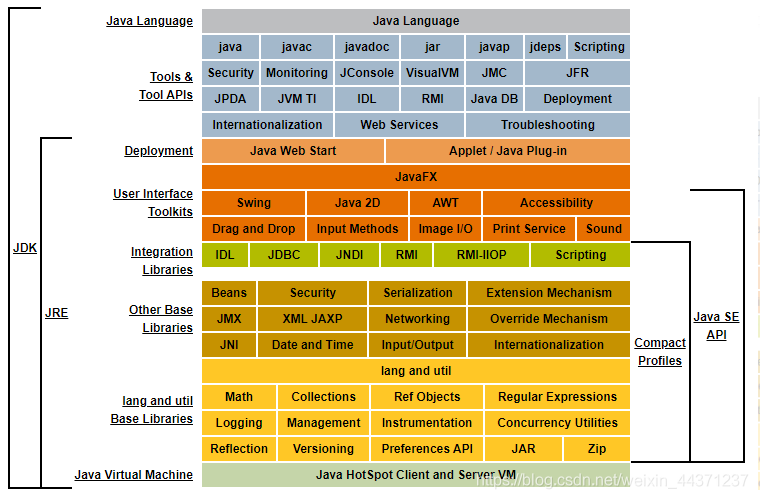**

- **jdk**：JRE+Kit（开发工具包），提供java程序的开发环境以及执行环境
- **jre**：jvm+核心类库（提供java程序启动时必须的信息），提供了java程序执行的环境
- **jvm**：java虚拟机，要事先在操作系统上安装对应版本的JVM，把java已经开发好了的程序放入到JVM中去执行，使得在不同的操作系统上执行相同的java程序得到的结果是一样的，屏蔽了底层操作系统差异性。**jvm会有单独笔记学习**

## JAVA程序运行机制

​		计算机的高级编程语言类型: 编译型 ，解释型. Java 语言是两种类型的结合，**先编译后解释**

```java
//我们先看看编译型:有一个负责翻译的程序来对我们的源代码进行转换，生成相对应的可执行代码。这个过程说得专业一点，就称为编译（Compile），而负责编译的程序自然就称为编译器（Compiler）。就类似于把一本中文书直接翻译成英文版进行出售。
//现在再看看解释型：打个比方：假如你打算阅读一本外文书，而你不知道这门外语，那么你可以找一名翻译，给他足够的时间让他从头到尾把整本书翻译好，然后把书的母语版交给你阅读（编译型）；或者，你也立刻让这名翻译辅助你阅读，让他一句一句给你翻译，如果你想往回看某个章节，他也得重新给你翻译。（解释型）
//编译型与解释型，两者各有利弊。前者由于程序执行速度快，同等条件下对系统要求较低，因此像开发操作系统、大型应用程序、数据库系统等时都采用它，像C/C++、Pascal/ObjectPascal（Delphi）、VB等基本都可视为编译语言，而一些网页脚本、服务器脚本及辅助开发接口这样的对速度要求不高、对不同系统平台间的兼容性有一定要求的程序则通常使用解释性语言，如Java、JavaScript、VBScript、Perl、Python等等。
//Java语言虽然比较接近解释型语言的特征，但在执行之前已经预先进行一次预编译，生成的代码是介于机器码和Java源代码之间的中介代码，运行的时候则由JVM（Java的虚拟机平台，可视为解释器）解释执行。它既保留了源代码的高抽象、可移植的特点，又已经完成了对源代码的大部分预编译工作，所以执行起来比“纯解释型”程序要快许多。
```

**第一步：编译** 

​		利用编译器（javac）将源程序编译成字节码à 字节码文件名：源文件名.class 

**第二步：运行** 

​		利用虚拟机（解释器，java）解释执行class字节码文件。

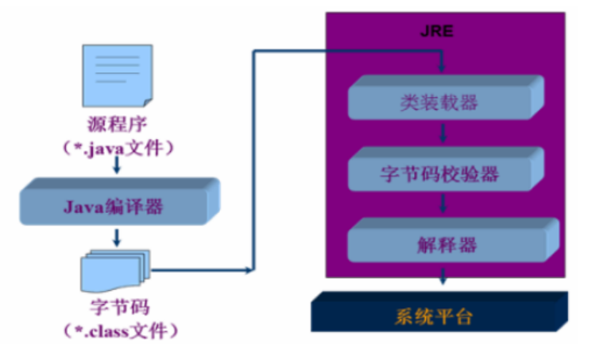

# 2.基础语法

### 关键字

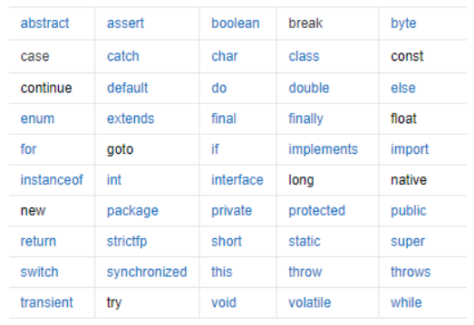

| **关键字**   | **含义**                                                     |
| ------------ | ------------------------------------------------------------ |
| abstract     | 表明类或者成员方法具有抽象属性                               |
| assert       | 断言，用来进行程序调试                                       |
| boolean      | 基本数据类型之一，声明布尔类型的关键字                       |
| break        | 提前跳出一个块                                               |
| byte         | 基本数据类型之一，字节类型                                   |
| case         | 用在switch语句之中，表示其中的一个分支                       |
| catch        | 用在异常处理中，用来捕捉异常                                 |
| char         | 基本数据类型之一，字符类型                                   |
| class        | 声明一个类                                                   |
| const        | 保留关键字，没有具体含义                                     |
| continue     | 回到一个块的开始处                                           |
| default      | 默认，例如，用在switch语句中，表明一个默认的分支。Java8 中也作用于声明接口函数的默认实现 |
| do           | 用在do-while循环结构中                                       |
| double       | 基本数据类型之一，双精度浮点数类型                           |
| else         | 用在条件语句中，表明当条件不成立时的分支                     |
| enum         | 枚举                                                         |
| extends      | 表明一个类型是另一个类型的子类型。对于类，可以是另一个类或者抽象类；对于接口，可以是另一个接口 |
| final        | 用来说明最终属性，表明一个类不能派生出子类，或者成员方法不能被覆盖，或者成员域的值不能被改变，用来定义常量 |
| finally      | 用于处理异常情况，用来声明一个基本肯定会被执行到的语句块     |
| float        | 基本数据类型之一，单精度浮点数类型                           |
| for          | 一种循环结构的引导词                                         |
| goto         | 保留关键字，没有具体含义                                     |
| if           | 条件语句的引导词                                             |
| implements   | 表明一个类实现了给定的接口                                   |
| import       | 表明要访问指定的类或包                                       |
| instanceof   | 用来测试一个对象是否是指定类型的实例对象                     |
| int          | 基本数据类型之一，整数类型                                   |
| interface    | 接口                                                         |
| long         | 基本数据类型之一，长整数类型                                 |
| native       | 用来声明一个方法是由与计算机相关的语言（如C/C++/FORTRAN语言）实现的 |
| new          | 用来创建新实例对象                                           |
| package      | 包                                                           |
| private      | 一种访问控制方式：私用模式                                   |
| protected    | 一种访问控制方式：保护模式                                   |
| public       | 一种访问控制方式：共用模式                                   |
| return       | 从成员方法中返回数据                                         |
| short        | 基本数据类型之一,短整数类型                                  |
| static       | 表明具有静态属性                                             |
| strictfp     | 用来声明FP_strict（单精度或双精度浮点数）表达式遵循[IEEE 754](https://baike.baidu.com/item/IEEE 754)算术规范 |
| super        | 表明当前对象的父类型的引用或者父类型的构造方法               |
| switch       | 分支语句结构的引导词                                         |
| synchronized | 表明一段代码需要同步执行                                     |
| this         | 指向当前实例对象的引用                                       |
| throw        | 抛出一个异常                                                 |
| throws       | 声明在当前定义的成员方法中所有需要抛出的异常                 |
| transient    | 声明不用序列化的成员域                                       |
| try          | 尝试一个可能抛出异常的程序块                                 |
| void         | 声明当前成员方法没有返回值                                   |
| volatile     | 表明两个或者多个变量必须同步地发生变化                       |
| while        | 用在循环结构中                                               |

### 数据类型

​		Java是一种**强类型语言**，每个变量都必须声明其类型。

#### 强弱类型语言

​		**强类型语言**也称为**强类型定义语言**。要求变量的使用要严格符合规定，**所有变量都必须先定义后才能使用**。

​		Java、.NET、C++等都是强制类型定义的。也就是说，一旦一个变量被指定了某个数据类型，如果不经过转换，那么它就永远是这个数据类型了。

​		安全性高，运行效率相对较慢，鱼和熊掌不可兼得！强类型定义语言在速度上可能略逊色于弱类型定义语言，但是强类型定义语言带来的严谨性能够有效的避免许多错误。

​		**弱类型语言**也称为**弱类型定义语言**。与强类型定义相反。像vb，php等就属于弱类型语言·。

​		在VBScript中，可以将字符串‘12’和整数3进行连接得到字符串‘123’，也可以把它看成整数123，而不需要显示转换。是不是十分的随便，我们Java就不是这样的。 但其实它们的类型没有改变，VB只是在判断出一个表达式含有不同类型的变量之后，自动在这些变量前加了一个clong（）或（int）（）这样的转换函数而已。能做到这一点其实是归功于VB的编译器的 智能化而已，这并非是VB语言本身的长处或短处。

#### 数据类型

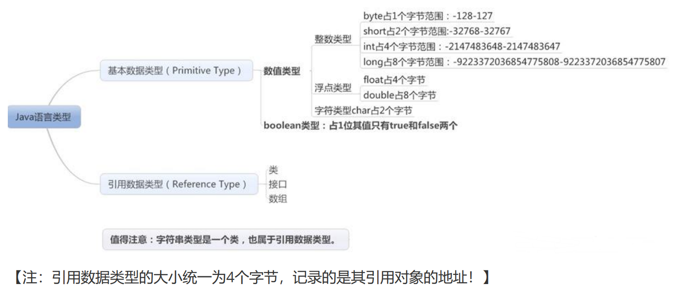

##### 字节扩展

```java
/*
位（bit）：是计算机 内部数据 储存的最小单位，11001100是一个八位二进制数。
字节（byte）：是计算机中 数据处理 的基本单位，习惯上用大写 B 来表示,
1B（byte,字节）= 8bit（位）
字符：是指计算机中使用的字母、数字、字和符号
ASCIIS码：
1个英文字母（不分大小写）= 1个字节的空间
1个中文汉字 = 2个字节的空间
1个ASCII码 = 一个字节
UTF-8编码：
1个英文字符 = 1个字节
英文标点 = 1个字节
1个中文（含繁体） = 3个字节
中文标点 = 3个字节
Unicode编码：
1个英文字符 = 2个字节
英文标点 = 2个字节
1个中文（含繁体） = 2个字节
中文标点 = 2个字节
1bit表示1位，
1Byte表示一个字节 1B=8b。
1024B=1KB
1024KB=1M
1024M=1G.
*/

```

##### 整型扩展

- 十进制整数，如：99, -500, 0。

-  八进制整数，要求以 0 开头，如：015。 

- 十六进制数，要求 0x 或 0X 开头，如：0x15 。

  ```java
  //整型
  int i=10;
  int i2=010;
  int i3=0x10;
  System.out.println(i); //10
  System.out.println(i2); //8
  System.out.println(i3); //16
  ```

##### 浮点型扩展

【金融面试问：银行金融业务用什么类型表示？】 

​		浮点类型float, double的数据不适合在不容许舍入误差的金融计算领域。 如果需要进行不产生舍入误差的精确数字计算，需要使用**BigDecimal**类。

```java
public static void main(String[] args) {
        float f = 0.1f;
        double d = 1.0/10;
        System.out.println(f==d); //false
        float d1 = 2131231231f;
        float d2 = d1+1;
        if(d1==d2){ //true
            System.out.println("d1==d2");
        }else{
            System.out.println("d1!=d2");
        }
    }
```

**主要理由：**

 		由于字长有限，浮点数能够精确表示的数是有限的，因而也是离散的。浮点数一般都存在舍入误差，很 多数字无法精确表示，其结果只能是接近，但不等于；二进制浮点数不能精确的表示0.1,0.01,0.001这样 10的负次幂。并不是所有的小数都能可以精确的用二进制浮点数表示。 

​		**最好完全避免使用浮点数比较 !** 

​		**大数值**：Java.math下面的两个有用的类：**BigInteger**和**BigDecimal**，这两个类可以处理任意长度的数值。**BigInteger**实现了任意精度的**整数运算**。**BigDecimal**实现了任意精度的**浮点运算**。

##### 字符型扩展

​		单引号用来表示字符常量。例如‘A’是一个字符，它与“A”是不同的，“A”表示一个字符串。 

​		char 类型用来表示在Unicode编码表中的字符。 Unicode编码被设计用来处理各种语言的所有文字，它占2个字节，可允许有65536个字符； 

​		【科普：2字节=16位 2的16次方=65536，我们用的Excel原来就只有这么多行，并不是无限的】

```java
public static void main(String[] args) {
        char c1 = 'a';
        char c2 = '中';
        System.out.println(c1);
        System.out.println((int) c1); //97
        System.out.println(c2);
        System.out.println((int) c2); //20013
    }
```

##### 类型转换

```java
低 ------------------------------------> 高
byte,short,char—> int —> long—> float —> double
```

数据类型转换必须满足如下规则：

-  不能对boolean类型进行类型转换。 

- 不能把对象类型转换成不相关类的对象。

-  在把容量大的类型转换为容量小的类型时必须使用强制类型转换。 转换过程中可能导致溢出或损失精度，例如：

  ```java
  int i =128;
  byte b = (byte)i; //-128
  //因为 byte 类型是 8 位，最大值为127，所以当 int 强制转换为 byte 类型时，值128 时候就会导致溢出。
  ```

- 浮点数到整数的转换是通过舍弃小数得到，而不是四舍五入，例如：

  ```java
  (int)23.7 == 23;
  (int)-45.89f == -45
  ```

- **自动类型转换**：容量小的数据类型可以自动转换为容量大的数据类型。
- **强制类型转换**:条件是转换的数据类型必须是兼容的,但可能造成精度降低或溢出。

##### jdk7扩展

​		J**DK7新特性: 二进制整数** 

​		由于我们在开发中也经常使用二进制整数，因此JDK7为我们直接提供了二进制整数的类型。 我们只要以：0b开头即可。

​		**JDK7新特性：下划线分隔符** 

​		在实际开发和学习中，如果遇到特别长的数字，读懂它令人头疼！JDK7为我们提供了下划线分隔符，可 以按照自己的习惯进行分割。

```java
public static void main(String[] args) {
int a = 0b0101;
int b = 1_2345_7893;
System.out.println(a); //5
System.out.println(b); //123457893
}
```


### 变量

#### 变量作用域

- 类变量（静态变量： static variable）：独立于方法之外的变量，用 static 修饰。从属于类，生命周期伴随类始终，从类加载到卸载。

- 实例变量（成员变量：member variable）：独立于方法之外的变量，不过没有 static 修饰。 如果不自行初始化，他会自动初始化成该类型的默认初始值。

- 局部变量（lacal variable）：类的方法中的变量。局部变量没有默认值，所以局部变量被声明后，必须经过初始化，才可以使用。

```java
public class Variable{
	static int allClicks=0; // 类变量
	String str="hello world"; // 实例变量
	public void method(){
		int i =0; // 局部变量
	}
}
```

#### 命名规范

1. 类成员变量：首字母小写和驼峰原则 : monthSalary
2. 局部变量：首字母小写和驼峰原则 
3. 常量：大写字母和下划线：MAX_VALUE 
4. 类名：首字母大写和驼峰原则: Man, GoodMan 
5. 方法名：首字母小写和驼峰原则: run(), runRun()

### 运算符

- 算术运算符: +，-，*，/，%，++，--*
- 赋值运算符 = 关系运算符: >，<，>=，<=，==，!= instanceof 
- 逻辑运算符: &&，||，! 
- 位运算符: &，|，^，~ ， >>，<<，>>> (了解！！！) 
- 条件运算符 ？： 
- 扩展赋值运算符:+=，-=，*=，/=

#### 二元运算符

##### 整数运算

​		如果两个操作数**有一个为Long**, 则**结果**也为**long** 

​		**没有long时，结果为int**。即使操作数全为shot,byte，结果也是int.

```java
public static void main(String[] args) {
    long a = 1231321311231231L;
    int b = 1213;
    short c = 10;
    byte d = 8;
    System.out.println((a+b+c+d)); //Long类型
    System.out.println((b + c + d));//Int类型
    System.out.println((c + d));//Int类型
}
```

##### 浮点运算

​		如果两个操作数**有一个为double, 则结果为double**

​		只有两个操作数**都是float**, 则**结果**才为**float**

```java
public static void main(String[] args) {
    float a = 3.14565F;
    double b = 3.194546464;
    float c = 1.3123123F;
    System.out.println(a+b); //double类型
    System.out.println(b+c); //double类型
    System.out.println(a+c); //float类型
}
```

#### 一元运算符

​		**自增（++）自减（--）**运算符是一种特殊的算术运算符，在算术运算符中需要两个操作数来进行运算， 而自增自减运算符是一个操作数，分为前缀和后缀两种。

```java
public static void main(String[] args) {
    int a = 3;
    int b = a++; //执行完后,b=3。先给b赋值，再自增。
    int c = ++a; //执行完后,c=5。先自增,再给b赋值
}
```

​		**注意：java中的乘幂处理**

```java
public static void main(String[] args) {
    int a = 3^2; //java中不能这么处理， ^是异或符号。
    double b = Math.pow(3, 2);
}
```

​		**Math扩展**

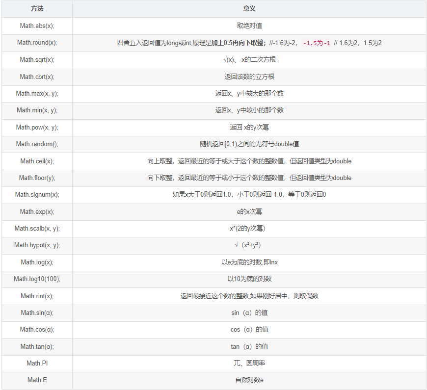

#### 逻辑运算符

- **普通逻辑运算符**：所有条件全判断
  - &：皆为true，则true，否则false
  - |：皆为false，则false，否则true
  - ^：结果不同为true，否则false
  - ！：结果相反
- **短路逻辑运算符**：一旦符合条件，后边不执行
  - &&：同&
  - ||：同|

#### 位运算符

##### 二级制与十进制转换

1. 十进制转二进制

   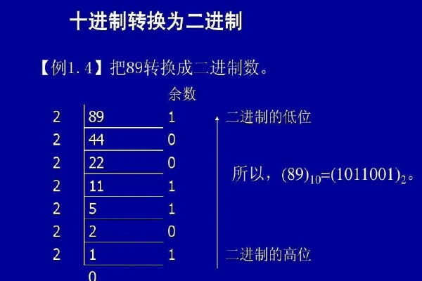

2. 二进制转十进制

   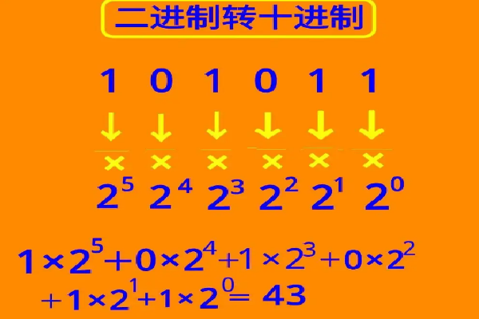

##### 位运算符

​		Java定义了位运算符，应用于整数类型(int)，长整型(long)，短整型(short)，字符型(char)，和字节型 (byte)等类型。位运算符作用在所有的位上，并且按位运算。

```java
A = 0011 1100  //60
B = 0000 1101  //13
-----------------
A & b = 0000 1100  //12，对应位都是1，为1，否则0
A | B = 0011 1101  //61，对应位都是0，为0，否则1
A ^ B = 0011 0001  //49，对应位相同，为0，否则1
~A = 1100 0011     //195，0变1,1变0
A<<2 = 1111 0000   //240，左移指定位数，相当于乘2乘2
A>>2 = 0000 1111   //15，右移指定位数，相当于除2除2
```

​		**【常见面试题：int a=2*8怎样运算效率最快？   2 << 3】**

#### 扩展运算符

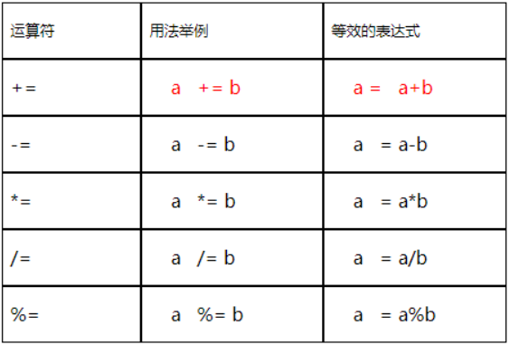

#### 三目运算符

​		**x ? y : z**   其中x为boolean类型表达式，先计算x的值，若为true，则整个三目运算的结果为表达式y的值，否则整 个运算结果为表达式z的值。

# 3.流程控制

## 顺序结构

​		JAVA的基本结构就是顺序结构，除非特别指明，否则就按照顺序一句一句执行。 

​		顺序结构是最简单的算法结构。

## 选择结构

​	**针对多重条件判断，逻辑复杂且不易维护的情况，可采用设计模式方式进行解决处理，后续学习设计模式可进行思考分析**

1. **if单选择结构**

   ```java
   if(布尔表达式){
   	//如果布尔表达式为true将执行的语句
   }
   ```

2. **if双选择结构**

   ```java
   if(布尔表达式){
   	//如果布尔表达式的值为true
   }else{
   	//如果布尔表达式的值为false
   }
   ```

3. **if多选择结构**

   ```java
   if(布尔表达式 1){
   	//如果布尔表达式 1的值为true执行代码
   }else if(布尔表达式 2){
   	//如果布尔表达式 2的值为true执行代码
   }else if(布尔表达式 3){
   	//如果布尔表达式 3的值为true执行代码
   }else {
   	//如果以上布尔表达式都不为true执行代码
   }
   ```

4. **嵌套的if结构**

   ```java
   if(布尔表达式 1){
   	//如果布尔表达式 1的值为true执行代码
       if(布尔表达式 2){
           //如果布尔表达式 2的值为true执行代码
       }
   }
   
   ```

5. **switch多选择结构**

   ```java
   switch(expression){
       case value :
           //语句
           break; //可选
       case value :
           //语句
           break; //可选
           
       //你可以有任意数量的case语句
       
       default : //可选
       	//语句
   }
   
   ```

   - switch 语句中的变量类型可以是： byte、short、int 或者 char。从 Java SE 7 开始，switch 支持 字符串 String 类型了，同时 case 标签必须为字符串常量或字面量。 
   - switch 语句可以拥有多个 case 语句。每个 case 后面跟一个要比较的值和冒号。 
   - case 语句中的值的数据类型必须与变量的**数据类型相同**，而且只能是常量或者字面常量。
   -  当变量的值与 case 语句的值相等时，那么 case 语句之后的语句开始执行，**直到 break 语句出现 才会跳出** switch 语句。 
   - 当遇到 break 语句时，switch 语句终止。程序跳转到 switch 语句后面的语句执行。case 语句不必须要包含 break 语句。如果没有 break 语句出现，程序会继续执行下一条 case 语句，直到出现 break 语句。 
   - switch 语句可以包含一个 default 分支，该分支一般是 switch 语句的最后一个分支（**可以在任何位置，但建议在最后一个**）。default 在没有 case 语句的值和变量值相等的时候执行。**default 分支不需要 break 语句**。

## 循环结构

​		Java中有三种主要的循环结构： 

- **while 循环** 

- **do…while 循环** 

- **for 循环** 

  在Java5中引入了一种主要用于数组的**增强型for循环**。

### while循环

```java
while( 布尔表达式 ) {
	//循环内容
}
```

### do...while循环

​		do…while 循环和 while 循环相似，不同的是，do…while 循环至少会执行一次。

```java
do {
    //代码语句
}while(布尔表达式);
```

### for循环

​		for循环语句是支持迭代的一种通用结构，是最有效、最灵活的循环结构。 

​		for循环执行的次数是在执行前就确定的。语法格式如下：

```java
for(初始化; 布尔表达式; 更新) {
	//代码语句
}
```

### 增强fo循环

​		Java5 引入了一种主要用于数组或集合的增强型 for 循环。 

​		Java 增强 for 循环语法格式如下:

```java
for(声明语句 : 表达式){
	//代码句子
}
```

​		**声明语句**：声明新的局部变量，该变量的类型必须和数组元素的类型匹配。其作用域限定在循环语句块，其值与此时数组元素的值相等。 

​		**表达式**：表达式是要访问的数组名，或者是返回值为数组的方法。

## break & continue

​		**break**在任何循环语句的主体部分，均可用break控制循环的流程。break用于**强行退出循环**，不执行循 环中剩余的语句。(break语句也在switch语句中使用)

​		 **continue** 语句用在循环语句体中，用于**终止某次循环**过程，即跳过循环体中尚未执行的语句，接着进行 下一次是否执行循环的判定。

# 4.方法

​		Java方法是语句的集合，它们在一起执行一个功能。 

- 方法是解决一类问题的步骤的有序组合 
- 方法包含于类或对象中 
- 方法在程序中被创建，在其他地方被引用

​		**设计方法的原则**：方法的本意是功能块，就是实现某个功能的语句块的集合。我们设计方法的时候，最好保持方法的**原子性**，就是一个方法只完成1个功能，**利于后期扩展**。

### 方法的优点

- 使程序变得更简短而清晰。 
- 有利于程序维护。 
- 可以提高程序开发的效率。
- 提高了代码的重用性。

### 方法的重载

​		在同一个类里面，允许存在一个以上同名方法，只要他们**参数类型**和**参数个数不同**即可。
​		方法重载特点：**与返回值无关**，只看参数列表。

### 可变参数

​		JDK 1.5 开始，Java支持传递同类型的可变参数给一个方法。

​		方法的可变参数的声明如下所示：

```java
typeName... parameterName
```

​		在方法声明中，在指定参数类型后加一个省略号(...) 。 

​		一个方法中只能指定一个可变参数，它必须是方法的最后一个参数。任何普通的参数必须在它之前声 明。

```java
public static void main(String args[]) {
    // 调用可变参数的方法
    printMax(34, 3, 3, 2, 56.5);
    printMax(new double[]{1, 2, 3});
}
public static void printMax( double... numbers) {
    if (numbers.length == 0) {
        System.out.println("No argument passed");
        return;
    }
    double result = numbers[0];
    //排序！
    for (int i = 1; i < numbers.length; i++){
        if (numbers[i] > result) {
        	result = numbers[i];
        }
    }
    System.out.println("The max value is " + result);
}
```

### 递归

​		递归是一种常见的解决问题的方法，即把**问题逐渐简单化**。递归的基本思想就是“**自己调用自己**”，一个 使用递归技术的方法将会直接或者间接的调用自己。 

​		利用递归可以用简单的程序来解决一些复杂的问题。它通常把一个大型复杂的问题层层转化为一个与原问题相似的规模较小的问题来求解，递归策略只需少量的程序就可描述出**解觉**过程所需要的**多次重复计算**，大大地**减少**了**程序的代码量**。递归的能力在于用有限的语句来定义对象的无限集合。

​		递归结构包括两个部分： 

  		1. **递归头**。解答：什么时候不调用自身方法。如果没有头，将陷入死循环。 
  		1. **递归体**。解答：什么时候需要调用自身方法。

```java
//5*4*3*2*1  5的阶乘
public static void main(String[] args) {
	System.out.println(f(5));
}
public static int f(int n) {
    if (1 == n){
    	return 1;
    else{
    	return n*f(n-1);
    }
}
```

#### 与迭代区别

​		**能不用递归就不用递归，递归都可以用迭代来代替。**

- 结构不同：程序调用自身称为递归，利用变量的原值推出新值称为迭代。

- 递归的优点大问题转化为小问题，可以减少代码量，同时代码精简，可读性好；

- 缺点就是递归调用浪费了空间，而且递归太深容易造成堆栈的溢出。

- 迭代的好处就是代码运行效率好，因为时间只因循环次数增加而增加，而且没有额外的空间开销；

- 缺点就是代码不如递归简洁

# 5.数组

​		数组的**定义**：

-  数组是相同类型数据的有序集合. 
- 数组描述的是相同类型的若干个数据,按照一定的**先后次序**排列组合而成。
-  其中,每一个数据称作一个数组元素,每个数组元素可以通过一个下标来访问它们.

​		 数组的**四个**基本**特点**： 

-  其长度是确定的。数组一旦被创建，它的大小就是不可以改变的。 
-  其元素必须是相同类型,不允许出现混合类型。 
- 数组中的元素可以是任何数据类型，包括基本类型和引用类型。 
- 数组变量属引用类型，**数组**也可以看成是**对象**，数组中的每个元素相当于该对象的成员变量。数组本身就是对象，Java中对象是在堆中的，因此数组无论保存原始类型还是其他对象类型，**数组对象本身是在堆中的**。

## 数组声明创建

```java
dataType[] arrayRefVar = new dataType[arraySize]; //首选的方法
或
dataType arrayRefVar[] = new dataType[arraySize]; //效果相同，但不是首选方法
```

## 内存分析

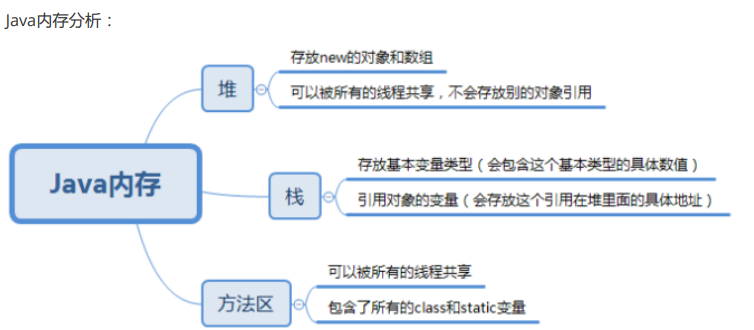

1.  声明的时候并没有实例化任何对象，只有在实例化数组对象时，JVM才分配空间，这时才与长度有 关。因此，声明数组时不能指定其长度(数组中元素的个数)，例如： int a[5]; //非法 
2. 声明一个数组的时候并没有数组被真正的创建。 
3. 构造一个数组，必须指定长度

```java
//1.声明一个数组
int[] myList = null;
```

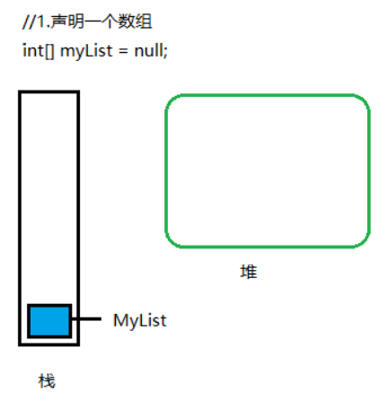

```java
//2.创建一个数组
myList = new int[10];
```

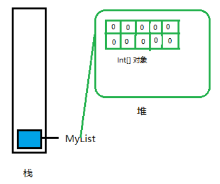

```java
//3.像数组中存值
myList[0] = 1;
myList[1] = 2;
myList[2] = 3;
myList[3] = 4;
myList[4] = 5;
myList[5] = 6;
myList[6] = 7;
myList[7] = 8;
myList[8] = 9;
myList[9] = 10;
```

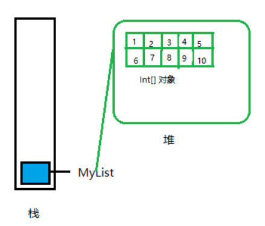

## Arrays 类

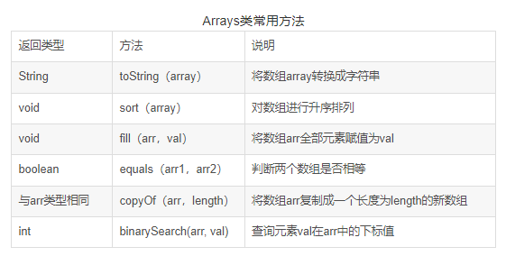

```java
public static void main(String[] args) {
		int a[]={12,20,13,42,72,26,35,10,46,26,53};
		int b[]={3,5,7,8,54,23,9};
		int c[]={3,5,7,8,54,23,9};
 
		String str=Arrays.toString(a);       //將特定數組轉換成字符串
		System.out.println("字符串："+str);
		
		Arrays.sort(a);                      //对数组array的元素进行升序排列
		System.out.println("排序后："+Arrays.toString(a)); 
		
		Arrays.fill(a,10);                   //所以元素都賦值成特定值
		System.out.println("賦值后："+Arrays.toString(a)); 
		
		boolean boo=Arrays.equals(a,b);      //判断两个数组是否相等(對應位置上的元素是否相等)
		boolean boo2=Arrays.equals(b, c);
		System.out.println("a:"+a);
		System.out.println("b:"+b);
		System.out.println("c:"+c);
		System.out.println("ab相等？"+boo);
		System.out.println("bc相等？"+boo2);
		
 
		int d[]=Arrays.copyOf(b,b.length);   //把数组复制成特定长度的数组,與直接賦值（引用傳遞）不同
		System.out.println("d:"+Arrays.toString(d));
		System.out.println("d:"+d);
		System.out.println("b:"+b);
		
		int i=Arrays.binarySearch(b, 5);     //查詢特定因素在數組中的下標標
		System.out.println("下標是："+i);
	}
```

### 二分查找法

```java
public static void main(String[] args) {
    int[] a = {1,2,323,23,543,12,59};
    Arrays.sort(a); //使用二分法查找，必须先对数组进行排序
    System.out.println("该元素的索引："+Arrays.binarySearch(a, 12));
    //如果数组包含多个带有指定值的元素，则无法保证找到的是哪一个。
}
```

## 排序算法

### 冒泡排序

​		冒泡排序算法的原理如下： 

1. 比较相邻的元素。如果第一个比第二个大，就交换他们两个。 
2. 对每一对相邻元素做同样的工作，从开始第一对到结尾的最后一对。在这一点，最后的元素应该会 是最大的 数。 
3. 针对所有的元素重复以上的步骤，除了最后一个。
4. 持续每次对越来越少的元素重复上面的步骤，直到没有任何一对数字需要比较。

```java
class Bubble {
    public int[] sort(int[] array) {
        int temp = 0;
        // 外层循环，它决定一共走几趟 //-1为了防止溢出
        for (int i = 0; i < array.length - 1; i++) {
            int flag = 0; //通过符号位可以减少无谓的比较，如果已经有序了，就退出循环
            //内层循环，它决定每趟走一次
            for (int j = 0; j < array.length - i - 1; j++) {
                //如果后一个大于前一个,则换位
                if (array[j + 1] > array[j]) {
                    temp = array[j];
                    array[j] = array[j + 1];
                    array[j + 1] = temp;
                    flag = 1;
            	}
            }
            if (flag == 0) {
            	break;
            }
        }
        return array;
    }
    public static void main(String[] args) {
        Bubble bubble = new Bubble();
        int[] array = {2, 5, 1, 6, 4, 9, 8, 5, 3, 1, 2, 0};
        int[] sort = bubble.sort(array);
        for (int num : sort) {
            System.out.print(num + "\t");
        }
    }
}
```

### 选择排序

​		选择排序（Selection sort）是一种简单直观的排序算法。它的工作原理是每一次从待排序的数据元素中选出最小（或最大）的一个元素，存放在序列的起始位置，然后，再从剩余未排序元素中继续寻找最小 （大）元素，然后放到排序序列的末尾。以此类推，直到全部待排序的数据元素排完。 

​		**选择排序是不稳定的排序方法。**

​		举个例子，序列arr = [5 8 5 2 9]，我们知道第一遍选择第1个元素5会和2交换，那么原序列中两个5的相对前后顺序就被破坏了，所以选择排序是一个不稳定的排序算法。

​		**简单地说就是所有相等的数经过某种排序方法后，仍能保持它们在排序之前的相对次序，我们就说这种排序方法是稳定的。反之，就是非稳定的。**

```java
class SelectSort{
    public int[] sort(int arr[]) {
        int temp = 0;
        for (int i = 0; i < arr.length - 1; i++) {// 认为目前的数就是最小的, 记
            录最小数的下标
            int minIndex = i;
            for (int j = i + 1; j < arr.length; j++) {
                if (arr[minIndex] > arr[j]) {// 修改最小值的下标
                    minIndex = j;
                }
            }// 当退出for就找到这次的最小值,就需要交换位置了
            if (i != minIndex) {//交换当前值和找到的最小值的位置
                temp = arr[i];
                arr[i] = arr[minIndex];
                arr[minIndex] = temp;
            }
        }
        return arr;
    }
    public static void main(String[] args) {
        SelectSort selectSort = new SelectSort();
        int[] array = {2, 5, 1, 6, 4, 9, 8, 5, 3, 1, 2, 0};
        int[] sort = selectSort.sort(array);
        for (int num : sort) {
            System.out.print(num + "\t");
        }
    }
}
```

### 6.稀疏数组

​		当一个数组中大部分元素为０，或者为同一个值的数组时，可以使用稀疏数组来保存该数组，稀疏数组的处理方法是：

- 记录数组一共有几行几列，有多少个不同的值
- 把具有不同值的元素的行列及值记录在一个小规模的数组中，从而缩小程序的规模

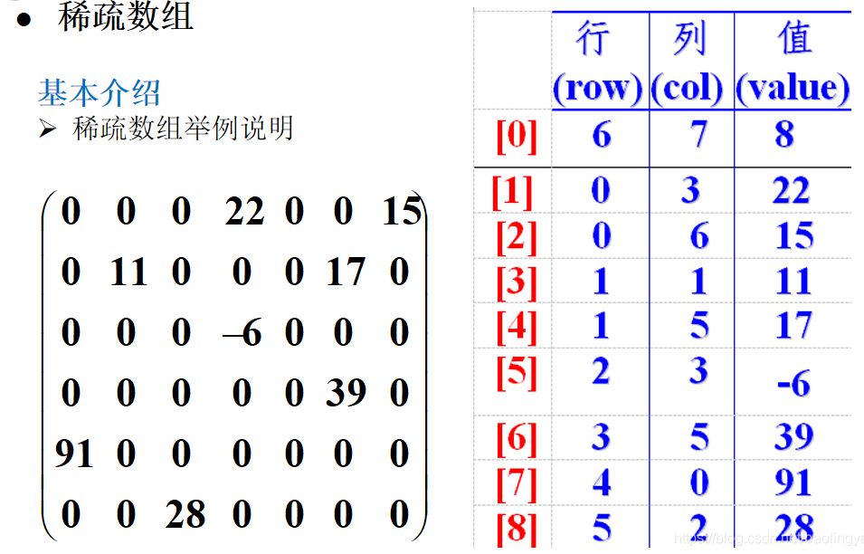

​		即第一行第一列记录记录原始数组行数，第一行第二列记录原始数组列数，第一行第三列总共有多少个值，第二行记录第一个有效数据，第三行记录第二个有效数据。

# 7.面向对象

## 思维模式

- **面向过程的思维模式**

​		面向过程的思维模式是简单的线性思维，思考问题首先陷入第一步做什么、第二步做什么的细节中。这种思维模式适合处理简单的事情，比如：上厕所。 

​		如果面对复杂的事情，这种思维模式会陷入令人发疯的状态！比如：如何造神舟十号！

- **面向对象的思维模式** 

​		面向对象的思维模式说白了就是分类思维模式。思考问题首先会解决问题需要哪些分类，然后对这些分类进行单独思考。最后，才对某个分类下的细节进行面向过程的思索。 

​		这样就可以形成很好的协作分工。比如：设计师分了10个类，然后将10个类交给了10个人分别进行详细设计和编码！ 

​		显然，面向对象适合处理复杂的问题，适合处理需要多人协作的问题！ 

​		如果一个问题需要多人协作一起解决，那么你一定要用面向对象的方式来思考！ 

**对于描述复杂的事物，为了从宏观上把握、从整体上合理分析，我们需要使用面向对象的思路来分析整 个系统。但是，具体到微观操作，仍然需要面向过程的思路去处理。**

## 创建与初始化对象

​		**使用new关键字创建对象** 

​		使用new关键字创建的时候，除了分配内存空间之外，还会给创建好的对象 进行默认的初始化 以 及对类中构造器的调用。

```java
Student s = new Student();
1)为对象分配内存空间,将对象的实例变量自动初始化默认值为0/false/null。(实例变量的隐式赋
值)
2)如果代码中实例变量有显式赋值,那么就将之前的默认值覆盖掉。(之后可以通过例子看到这个现象)
例如:显式赋值
private String name = "tom";
3)调用构造器
4)把对象内存地址值赋值给变量。(=号赋值操作)
```

## 构造器

​		类中的构造器也称为构造方法，是在进行创建对象的时候必须要调用的。

**特点:** 

1.  必须和类的名字相同 
2. 必须没有返回类型,也不能写void 

**作用**: 

1.  使用new创建对象的时候必须使用类的构造器  
2. 构造器中的代码执行后,可以给对象中的属性初始化赋值

```java
public class Student{
    private String name;
    public Student(){
        name = "tom";
    }
}
```

**构造器重载** 

​		除了无参构造器之外,很多时候我们还会使用有参构造器,在创建对象时候可以给属性赋值。

```java
public class Student{
    private String name;
    public Student(){
        name = "tom";
    }
    public Student(String name){
        this.name = name;
    }
}
```

**注意**

​		在java中,即使我们在编写类的时候没有写构造器,那么在编译之后也会自动的添加一个无参构造器,这个无参构造器也被称为默认的构造器。

​		但是,如果我们手动的编写了一个构造器,那么编译后就不会添加任何构造器了。

```java
public class Student{
}
main:
//编译通过,因为有无参构造器
Student s = new Student();

public class Student{
    private String name;
    public Student(String name){
    	this.name = name;
    }
}
main:
//编译报错,因为没有无参构造器
Student s = new Student();
//编译通过,因为有 有参构造器
Student s = new Student("ces");
```

## OOP（面向对象编程）

​		**面向对象编程的本质就是：以类的方式组织代码，以对象组织(封装)数据。**

**抽象(abstract)**

​		**将多个物体共同点归纳出来，就是抽出像的部分**！抽象并不打算了解全部问题，而只是选择其中的一部分，暂时不用关注细节。 

​		例如:要设计一个学生成绩管理系统，那么对于学生，只关心他的班级、学号、成绩等，而不用去关心他的身高、体重这些信息。 

**封装(Encapsulation)**

​		封装是把过程和数据包围起来，对数据的访问只能通过指定的方式。 

​		在定义一个对象的特性的时候，有必要决定这些特性的可见性，即哪些特性对外部是可见的，哪些特性 用于表示内部状态。 

​		通常，应禁止直接访问一个对象中数据的实际表示，而应通过操作接口来访问，这称为**信息隐藏**。 

​		封装保证了模块具有较好的独立性，使得程序维护修改较为容易。对应用程序的修改仅限于类的内部， 因而可以将应用程序修改带来的影响减少到最低限度。

**继承(inheritance)**

​		继承是一种联结类的层次模型，并且允许和支持类的重用，它提供了一种明确表述共性的方法。 

​		**新类继承**了**原始类**后,新类就继承了原始类的特性，**新类称为原始类的派生类(子类)**，而**原始类称为新 类的基类(父类)**。 

​		派生类(子类)可以从它的基类(父类)那里**继承方法和实例变量**，并且**派生类(子类)**中可以**修改或增加新的方法**使之更适合特殊的需要继承性很好的解决了**软件的可重用性**问题。比如说，所有的Windows应 用程序都有一个窗口，它们可以看作都是从一个窗口类派生出来的。但是有的应用程序用于文字处理，有 的应用程序用于绘图，这是由于派生出了不同的子类，各个子类添加了不同的特性。

**多态(polymorphism)**

​		多态是同一个行为具有多个不同表现形式或形态的能力。

**从认识论角度考虑是先有对象后有类。对象，是具体的事物。类，是抽象的，是对对象的抽象。 从代码运行角度考虑是先有类后有对象。类是对象的模板。**

### 封装

​		**“高内聚，低耦合”**。高内聚就是类的内部数据操作细节自己完成，不允许外 部干涉；低耦合：仅暴露少量的方法给外部使用。

#### 步骤

1.  使用private 修饰需要封装的成员变量。  

2. 提供一个公开的方法设置或者访问私有的属性 

   设置通过set方法，命名格式： set属性名（）; 属性的首字母要大写 

   访问通过get方法，命名格式： get属性名（）; 属性的首字母要大写

```java
//set负责给属性赋值
//get负责返回属性的值
public class Student{
    private String name;
    public void setName(String name){
        this.name = name;
    }
    public String getName(){
        return this.name;
    }
}
public class Test {
    public static void main(String[] args) {
        Student s = new Student();
        s.setName("tom");
        System.out.println(s.getName());
    }
}
```

#### 作用

1. 提高程序的安全性，保护数据
2. 隐藏代码的实现细节 
3. 统一用户的调用接口 
4. 提高系统的可维护性 
5. 便于调用者调用。

### 继承

1. 继承是类和类之间的一种关系。除此之外,类和类之间的关系还有依赖、组合、聚合等。 

2. 继承关系的俩个类，一个为子类(派生类),一个为父类(基类)。子类继承父类,使用关键字extends来表示。

   ```java
   public class student extends Person{
   }
   ```

3. 子类和父类之间,从意义上讲应该具有"is a"的关系。

4. 类和类之间的继承是单继承， 接口可以多继承！

5. 父类中的属性和方法可以被子类继承。

#### 作用

1. 继承的本质在于抽象。类是对对象的抽象，继承是对某一批类的抽象
2. 为了提高代码的复用性

#### Object类

​		java中的每一个类都是"直接" 或者 "间接"的继承了Object类.所以每一个对象都和Object类有"is a"的关系。从API文档中,可以看到任何一个类最上层的父类都是Object。(Object类本身除外)AnyClass is a Object。

```java
System.out.println(任何对象 instanceof Object);
//输出结果:true
//注:任何对象也包含数组对象
例如:
//编译后,Person类会默认继承Object
public class Person{}
//Student是间接的继承了Object
public class Student extends Person{}
```

​		在Object类中,提供了一些方法被子类继承,那么就意味着,在java中,任何一个对象都可以调用这些被继承过来的方法。(因为Object是所以类的父类) 

​		例如:toString方法、equals方法、getClass方法等

#### Super关键字

​		子类继承父类之后,在子类中可以使用this来表示访问或调用子类中的属性或方法,使用super就表示访问或调用父类中的属性和方法。

**注意**

1. 用super调用父类构造方法，必须是构造方法中的第一个语句。 
2. super只能出现在子类的方法或者构造方法中。 
3. super 和 this 不能够同时调用构造方法。（因为this也是在构造方法的第一个语句）

**super 和 this 的区别**

1. 代表的事物不一样

   this：代表所属方法的调用者对象。

   super：代表父类对象的引用空间。

2. 使用前提不一致

   this：在非继承的条件下也可以使用。

   super：只能在继承的条件下才能使用。

3. 调用构造方法

   this：调用本类的构造方法。

   super：调用的父类的构造方法

#### 重写

1. 必须存在继承关系。
2. 方法名和形式参数，必须跟父类是一致的。 
3. 子类的权限修饰符必须要大于或者等于父类的权限修饰符。( private < protected < public，friendly < public ) 
4. 子类的返回值类型必须小于或者等于父类的返回值类型。( 子类 < 父类 ) 数据类型没有明确的上下级关系 
5. 子类的异常类型要小于或者等于父类的异常类型。

### 多态

​		多态可以让我们不用关心某个对象到底是什么具体类型，就可以使用该对象的某些方法，从而实现更加 灵活的编程，提高系统的可扩展性。

​		一个对象的实际类型是确定,但是可以指向这个对象的引用的类型,却是可以是这对象实际类型的任意 父类型。

1. 一个父类引用可以指向它的任何一个子类对象

   ```java
   Person p = null;
   p = new Student();
   p = new Teacher();
   p = new Person();
   ```

2. 调用到的run方法,是Student从Person继承过来的run方法

   ```java
   public class Person{
       public void run(){}
   }
   public class Student extends Person{
       public void run(){
   		//重写run方法
       }
   }
   //调用到的run方法,是Student中重写的run方法
   main:
   Person p = new Student();
   p.run();
   //注：子类继承父类,调用a方法，如果a方法在子类中没有重写,那么就是调用的是子类继承父类的a方法,如果重写了,那么调用的就是重写之后的方法。
   ```

3. 子类中独有方法的调用

   ```java
   public class Person{
       public void run(){}
   }
   public class Student extends Person{
       public void test(){
       }
   }
   main:
   Person p = new Student();
   //调用到继承的run方法
   p.run();
   //编译报错,因为编译器检查变量p的类型是Person,但是在Person类中并没有发现test方法,所以编译报错.
   p.test();
   ```

   **原理：编译看左边，运行不一定看右边。**

   ​		编译看左边：java 编译器在编译的时候会检测引用类型中含有指定的成员，如果没有就会报错。 子类的成员是特有的，父类的没有的，所以他是找不到的。

   ​		运行不一定看右边：如果方法存在重写，调用子类方法（即右边），不存在重写，调用父类方法（即左边）。

4. 子类引用和父类引用指向对象的区别

   ```java
   Student s = new Student();
   Person p = new Student();
   Object o = new Student();
   ```

   ​		变量s能调用的方法是Student中有的方法(包括继承过来的),变量p能调用的方法是Person中有的方法(包 括继承过来的)。 

   ​		变量p是父类型的,p不仅可以指向Student对象,还可以指向Teacher类型对象等,但是变量s只能指 Studnet类型对象,及Student子类型对象。变量p能指向对象的范围是比变量s大的。

   ​		Object类型的变量o,能指向所有对象,它的范围最大,但是使用变量o能调用到的方法也是最少的,只能调用 到Object中的声明的方法,因为变量o声明的类型就是Object。

   ​		注：java中的方法调用,是运行时动态和对象绑定的,不到运行的时候,是不知道到底哪个方法被调用的。

#### 重写、重载和多态的关系

- **重载是编译时多态**：调用重载的方法,在编译期间就要确定调用的方法是谁,如果不能确定则编译报错
- **重写是运行时多态**：调用重写的方法,在运行期间才能确定这个方法到底是哪个对象中的。这个取决于调用方法的引用,在运行 期间所指向的对象是谁,这个引用指向哪个对象那么调用的就是哪个对象中的方法。(java中的方法调用, 是运行时动态和对象绑定的)

#### 注意事项

1. 多态是方法的多态，属性没有多态性。 

2. 编写程序时，如果想调用运行时类型的方法，只能进行类型转换。不然通不过编译器的检查。但是 如果两个没有关联的类进行强制转换，会报：ClassCastException。 比如：本来是狗，我把它转成 猫。就会报这个异常。 

3. 多态的存在要有3个必要条件：**要有继承，要有方法重写，父类引用指向子类对象**

   ​		既然多态存在必须要有“子类重写父类方法”这一条件，那么以下三种类型的方法是没有办法表现出多态特性的（因为不能被重写）： 

   1. static方法，因为被static修饰的方法是属于类的，而不是属于实例的 
   1. final方法，因为被final修饰的方法无法被子类重写 
   1. private方法和protected方法，前者是因为被private修饰的方法对子类不可见，后者是因为尽管被 protected修饰的方法可以被子类见到，也可以被子类重写，但是它是无法被外部所引用的，一个不能被外部引用的方法，怎么能谈多态呢

#### instanceof

```java
public class Person{
	public void run(){}
}
public class Student extends Person{
}
public class Teacher extends Person{
}

main:
Object o = new Student();
System.out.println(o instanceof Student);//true
System.out.println(o instanceof Person);//true
System.out.println(o instanceof Object);//true
System.out.println(o instanceof Teacher);//false
System.out.println(o instanceof String);//false
\---------------------------
Person o = new Student();
System.out.println(o instanceof Student);//true
System.out.println(o instanceof Person);//true
System.out.println(o instanceof Object);//true
System.out.println(o instanceof Teacher);//false
//编译报错
System.out.println(o instanceof String);
\---------------------------
Student o = new Student();
System.out.println(o instanceof Student);//true
System.out.println(o instanceof Person);//true
System.out.println(o instanceof Object);//true
//编译报错
System.out.println(o instanceof Teacher);
//编译报错
System.out.println(o instanceof String);
```

**【分析1】**

```java
System.out.println(x instanceof Y);
//该代码能否编译通过,主要是看声明变量x的类型和Y是否存在子父类的关系.有"子父类关"系就编译通过,没有子父类关系就是编译报错.
```

**【分析2】**

```java
System.out.println(x instanceof Y);
//输出结果是true还是false,主要是看变量x所指向的对象实际类型是不是Y类型的"子类型".
```

#### 类型转换

1. 父类引用可以指向子类对象，子类引用不能指向父类对象。
2. 把子类对象直接赋给父类引用叫upcasting向上转型，向上转型不用强制转型。 如Father father = new Son(); 
3. 把指向子类对象的父类引用赋给子类引用叫向下转型（downcasting），要强制转型。 如father就是一个指向子类对象的父类引用，把father赋给子类引用son 即Son son =（Son） father； 其中father前面的（Son）必须添加，进行强制转换。 
4. upcasting 会丢失子类特有的方法,但是子类overriding 父类的方法，子类方法有效 
5. 向上转型的作用，减少重复代码，父类为参数，调有时用子类作为参数，就是利用了向上转型。这样 使代码变得简洁。体现了JAVA的抽象编程思想。

## 修饰符

### static

#### static变量

​		在类中,使用static修饰的成员变量,就是静态变量,反之为非静态变量。

​		**静态变量和非静态变量的区别** ：静态变量属于类的,"可以"使用类名来访问,非静态变量是属于对象的,"必须"使用对象来访问。

​		静态变量对于类而言在内存中只有一个,能被类的所有实例所共享。实例变量对于类的每个实例都有一份, 它们之间互不影响。

​		在加载类的过程中为静态变量分配内存,实例变量在创建对象时分配内存，所以静态变量可以使用类名来 直接访问,而不需要使用对象来访问。

#### static方法

​		在类中,使用static修饰的成员方法,就是静态方法,反之为非静态方法。

​		**静态方法和非静态方法的区别**：静态方法数属于类的,"可以"使用类名来调用,非静态方法是属于对象的,"必须"使用对象来调用。

​		静态方法"不可以"直接访问类中的非静态变量和非静态方法,但是"可以"直接访问类中的静态变量和静态方法。

​		非静态方法"可以"直接访问类中的非静态变量和非静态方法,也"可以"直接访问类中的静态变量和静态方法。

​		注意:this和super在类中属于非静态的变量(静态方法中不能使用)。

#### 代码块

**类中可以编写代码块和静态代码块**

```java
public class Person {
    {
    //代码块(匿名代码块)
    }
    static{
    //静态代码块
    }
}
```

**执行顺序：静态代码块>匿名代码块>构造器**

​		因为没有名字,在程序并不能主动调用这些代码块。 

​		匿名代码块是在创建对象的时候自动执行的,并且在构造器执行之前。同时匿名代码块在每次创建对象的时候都会自动执行.。

​		静态代码块是在类加载完成之后就自动执行,并且只执行一次.。

​		注:每个类在第一次被使用的时候就会被加载,并且一般只会加载一次。

**作用**

​		匿名代码块的作用是给对象的成员变量初始化赋值,但是因为构造器也能完成这项工作,所以匿名代码块使用的并不多。 

​		静态代码块的作用是给类中的静态成员变量初始化赋值。在构造器中给静态变量赋值,并不能保证能赋值成功,因为构造器是在创建对象的时候才指向,但是静态变量可以不创建对象而直接使用类名来访问。

**创建和初始化对象的过程**

```java
Student s = new Student();//Student类之前没有进行类加载
/**
1. 类加载,同时初始化类中静态的属性
2. 执行静态代码块
3. 分配内存空间,同时初始化非静态的属性(赋默认值,0/false/null)
4. 调用Student的父类构造器
5. 对Student中的属性进行显示赋值(如果有的话)
6. 执行匿名代码块
7. 执行构造器
8. 返回内存地址
**/
```

### final

1. **修饰类**：用final修饰的类不能被继承,没有子类。
2. **修饰方法**：用final修饰的方法可以被继承,但是不能被子类的重写
3. **修饰变量**：用final修饰的变量表示常量,只能被赋一次值.其实使用final修饰的变量也就成了常量了,因为值不会再变了

### abstract

 		abstract修饰符可以用来修饰方法也可以修饰类,如果修饰方法,那么该方法就是抽象方法;如果修饰类,那 么该类就是抽象类。

​		抽象类中可以没有抽象方法,但是有抽象方法的类一定要声明为抽象类。

#### 特点和作用

​		抽象类,不能使用new关键字来创建对象,它是用来让子类继承的。 

​		抽象方法,只有方法的声明,没有方法的实现,它是用来让子类实现的。 

​		注:子类继承抽象类后,需要实现抽象类中没有实现的抽象方法,否则这个子类也要声明为抽象类。

#### 思考

思考1 : 抽象类不能new对象,那么抽象类中有没有构造器?

​		抽象类是不能被实例化,抽象类的目的就是为实现多态中的共同点,抽象类的构造器会在子类实例化时调 用,因此它也是用来实现多态中的共同点构造，不建议这样使用！

思考2 : 抽象类和抽象方法意义(为什么要编写抽象类、抽象方法)

​		打个比方，要做一个游戏。如果要创建一个角色，如果反复创建类和方法会很繁琐和麻烦。建一个抽象类 后。若要创建角色可直接继承抽象类中的字段和方法，而抽象类中又有抽象方法。如果一个角色有很多种 职业，每个职业又有很多技能，要是依次实例这些技能方法会显得想当笨拙。定义抽象方法，在需要时继 承后重写调用，可以省去很多代码。 

​		总之抽象类和抽象方法起到一个框架作用。很方便后期的调用和重写 抽象方法是为了程序的可扩展性。

​		重写抽象方法时即可实现同名方法但又非同目的的要求。

## 接口

### 接口的本质

​		普通类：只有具体实现

​		抽象类：具体实现和规范(抽象方法) 都有

​		接口：只有规范！

### 接口与抽象类的区别

- 接口就是比“抽象类”还“抽象”的“抽象类”，可以更加规范的对子类进行约束。全面地专业地实现了： 规范和具体实现的分离。 
- 抽象类还提供某些具体实现，接口不提供任何实现，接口中所有方法都是抽象方法。接口是完全面向规范的，规定了一批类具有的公共方法规范。 
- 从接口的实现者角度看，接口定义了可以向外部提供的服务。 
- 从接口的调用者角度看，接口定义了实现者能提供那些服务。 
- 接口是两个模块之间通信的标准，通信的规范。如果能把你要设计的系统之间模块之间的接口定义 好，就相当于完成了系统的设计大纲，剩下的就是添砖加瓦的具体实现了。大家在工作以后，做系统时往往就是使用“面向接口”的思想来设计系统。

​		抽象类也是类,除了可以写抽象方法以及不能直接new对象之外,其他的和普通类没有什么不一样的。接 口已经另一种类型了,和类是有本质的区别的,所以不能用类的标准去衡量接口。

​		**声明类的关键字是class,声明接口的关键字是interface。**

​		**抽象类是用来被继承的,java中的类是单继承。**

​		 类A继承了抽象类B,那么类A的对象就属于B类型了,可以使用多态 

​		一个父类的引用,可以指向这个父类的任意子类对象 

​		**注:继承的关键字是extends** 

​		**接口是用来被类实现的,java中的接口可以被多实现。** 

​		类A实现接口B、C、D、E..,那么类A的对象就属于B、C、D、E等类型了,可以使用多态 

​		一个接口的引用,可以指向这个接口的任意实现类对象 

​		**注:实现的关键字是implements**

### 接口中的方法都是抽象方法

​		接口中可以不写任何方法,但如果写方法了,该方法必须是抽象方法。

```java
public interface Action{
    public abstract void run();
    //默认就是public abstract修饰的
    void test();
    public void go();
}
```

### 接口中的变量都是静态常量(public static final修饰)

​		接口中可以不写任何属性,但如果写属性了,该属性必须是public static final修饰的静态常量。 

​		注:可以直接使用接口名访问其属性。因为是public static修饰的 

​		注:声明的同时就必须赋值.(因为接口中不能编写静态代码块)

```java
public interface Action{
    public static final String NAME = "tom";
    //默认就是public static final修饰的
    int AGE = 20;
}
main:
System.out.println(Action.NAME);
System.out.println(Action.AGE);
```

### 一个接口可以继承多个父接口

```java
public interface A{
    public void testA();
}
public interface B{
    public void testB();
}
//接口C把接口A B中的方法都继承过来了
public interface C extends A,B{
    public void testC();
}
//Student相当于实现了A B C三个接口,需要实现所有的抽象方法
//Student的对象也就同时属于A类型 B类型 C类型
public class Student implements C{
    public viod testA(){}
    public viod testB(){}
    public viod testC(){}
}
main:
C o = new Student();
System.out.println(o instanceof A);//true
System.out.println(o instanceof B);//true
System.out.println(o instanceof C);//true
System.out.println(o instanceof Student);//true
System.out.println(o instanceof Object);//true
System.out.println(o instanceof Teacher);//false
//编译报错
System.out.println(o instanceof String);
```

## 内部类

​		内部类就是在一个类的内部在定义一个类，比如，A类中定义一个B类，那么B类相对A类来说就称为内 部类，而A类相对B类来说就是外部类了。 

​		内部类不是在一个java源文件中编写两个平行的两个类,而是在一个类的内部再定义另外一个类。 我们可以把外边的类称为外部类,在其内部编写的类称为内部类。 

​		内部类分为四种： 

1. **成员内部类** 
2. **静态内部类** 
3. **局部内部类** 
4. **匿名内部类**

### 成员内部类（实例内部类、非静态内部类）

​		成员内部类中不能写静态属性和方法

```java
public class Outer {
    private int id;
    public void out(){
        System.out.println("这是外部类方法");
    }
    class Inner{
        public void in(){
            System.out.println("这是内部类方法");
        }
    }
}

public class Test{
    public static void main(String[] args) {
        //实例化成员内部类分两步
        //1、实例化外部类
        Outer outObject = new Outer();
		//2、通过外部类调用内部类
        Outer.Inner inObject = outObject.new Inner();
		//测试，调用内部类中的方法
        inObject.in();//打印：这是内部类方法
    }
}
```

### 静态内部类

​		使用static修饰的内部类就叫静态内部类。

1. 我们上面说的内部类能够调用外部类的方法和属性，在静态内部类中就不行了，因为静态内部类没有了指向外部类对象的引用。除非外部类中的方法或者属性也是静态的。这就回归到了static关键字的用法。 
2. 静态内部类能够直接被外部类给实例化，不需要使用外部类对象 
3. 静态内部类中可以声明静态方法和静态变量，但是非静态内部类中就不可以声明静态方法和静态变量

### 局部内部类

1. 局部内部类是在一个方法内部声明的一个类 
2. 局部内部类中可以访问外部类的成员变量及方法 
3. 局部内部类中如果要访问该内部类所在方法中的局部变量,那么这个局部变量就必须是final修饰的

```java
public class Outer {
    private int id;
    //在method01方法中有一个Inner内部类，这个内部类就称为局部内部类
    public void method01(){
        class Inner{
            public void in(){
                System.out.println("这是局部内部类");
            }
        }
    }
}
```

**为什么需要使用final？** 

final修饰变量：变为常量，会在常量池中放着，逆向思维想这个问题，如果不实用final修饰，当局部内 部类被实例化后，方法弹栈，局部变量随着跟着消失，这个时候局部内部类对象在想去调用该局部变 量，就会报错，因为该局部变量已经没了，当局部变量用fanal修饰后，就会将其加入常量池中，即使方 法弹栈了，该局部变量还在常量池中呆着，局部内部类也就是够调用。所以局部内部类想要调用局部变 量时，需要使用final修饰，不使用，编译度通不过。

**实例化**

```java
public class Outer {
    private int id;
    public void out(){
        System.out.println("外部类方法");
    }
    public void method01(){
        class Inner{
            public void in(){
                System.out.println("这是局部内部类");
            }
        }
		//关键在这里，在method01方法中自己创建内部类实例，然后调用内部类中的方法
        //等待外部类调用method01方法，就可以执行到内部类中的方法了。
        Inner In = new Inner();
        In.in();
    }
}
```

### 匿名内部类

​		在这四种内部类中，以后的工作可能遇到最多的是匿名内部类，所以说匿名内部类是最常用的一种内部类。

​		什么是匿名对象？如果一个对象只要使用一次，那么我们就是需要new Object().method()。 就可以 了，而不需要给这个实例保存到该类型变量中去。这就是匿名对象。

```java
public interface Usb(){
	void open();//打开设备功能
	void colse();//关闭设备功能
}
public static void main(String[] args){
	new Usb() {
			
			@Override
			public void open() {
				System.out.println("设备功能开启。。");
				
			}
			
			@Override
			public void close() {
				System.out.println("设备功能关闭。。");
				
			}
		}.open();
}
```

# 8.异常

## 三种类型的异常

- **检查性异常**：最具代表的检查性异常是用户错误或问题引起的异常，这是程序员无法预见的。例如 要打开一个不存在文件时，一个异常就发生了，这些异常在编译时不能被简单地忽略。 
- **运行时异常**： 运行时异常是可能被程序员避免的异常。与检查性异常相反，运行时异常可以在编译时被忽略。 
- **错误**： 错误不是异常，而是脱离程序员控制的问题。错误在代码中通常被忽略。例如，当栈溢出时，一个错误就发生了，它们在编译也检查不到的。

## 异常体系结构

​		Java把异常当作对象来处理，并定义一个基类 **java.lang.Throwable** 作为所有异常的超类。 

​		在Java API中已经定义了许多异常类，这些异常类分为两大类，**错误Error和异常Exception**。 

Java异常层次结构图：

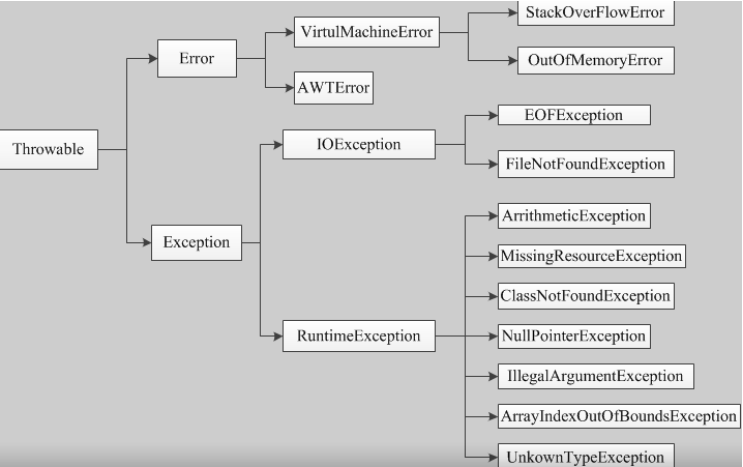

## 异常之间的区别与联系

### Error

​		**Error** 类对象由 Java 虚拟机生成并抛出，大多数错误与代码编写者所执行的操作无关。

​		 比如说：

​		 Java虚拟机运行错误（ **Virtual MachineError** ），当JVM不再有继续执行操作所需的内存资源时， 将出现 **OutOfMemoryError** 。这些异常发生时，Java虚拟机（JVM）一般会选择线程终止； 

​		还有发生在虚拟机试图执行应用时，如类定义错误（ **NoClassDefFoundError** ）、链接错误 （ **LinkageError** ）。这些错误是不可查的，因为它们在应用程序的控制和处理能力之 外，而且绝大 多数是程序运行时不允许出现的状况。

​		 对于设计合理的应用程序来说，即使确实发生了错误，本质上也不应该试图去处理它所引起的异常状 况。在Java中，错误通常是使用 **Error** 的子类描述。

### Exception

​		在 **Exception** 分支中有一个重要的子类 **RuntimeException** （运行时异常），该类型的异常自动为你所编写的程序定义 **ArrayIndexOutOfBoundsException** （数组下标越界）、 **NullPointerException** （空指针异常）、**ArithmeticException** （算术异常）、 **MissingResourceException** （丢失资源）、 **ClassNotFoundException** （找不到类）等异常，这些异常是不检查异常，程序中可以选择捕获处 理，也可以不处理。

​		这些异常一般是由程序逻辑错误引起的，程序应该从逻辑角度尽可能避免这类异常的发生；而 **RuntimeException 之外**的异常我们统称为**非运行时异常**，类型上属于 **Exception** 类及其子类， 从程序语法角度讲是必须进行处理的异常，如果不处理，程序就不能编译通过。如 **IOException** 、 **SQLException** 等以及**用户自定义的 Exception 异常**，一般情况下不自定义检 查异常。 

​		**注意**： Error 和 Exception 的区别： Error 通常是灾难性的致命的错误，是程序无法控制和 处理的，当出现这些异常时，Java虚拟机（JVM）一般会选择终止线程； Exception 通常情况下是可以被程序处理的，并且在程序中应该尽可能的去处理这些异常。

### 检查异常和不受检查异常

​		检查异常：在正确的程序运行过程中，很容易出现的、情理可容的异常状况，在一定程度上这种异常的发生是可以预测的，并且一旦发生该种异常，就必须采取某种方式进行处理。 

​		解析：**除了RuntimeException及其子类以外，其他的Exception类及其子类都属于检查异常**，当程序中可能出现这类异常，**要么使用try-catch语句进行捕获**，**要么用throws子句抛出**，否则编译无法通过。 

​		不受检查异常：**包括RuntimeException及其子类和Error**。 

​		分析： 不受检查异常为编译器不要求强制处理的异常， 检查异常则是编译器要求必须处置的异常。

## 异常处理机制

### 抛出异常

​		要理解抛出异常，首先要明白什么是异常情形（exception condition），它是指阻止当前方法或作用域继续执行的问题。其次把异常情形和普通问题相区分，普通问题是指在当前环境下能得到足够的信息， 总能处理这个错误。 

​		对于异常情形，已经无法继续下去了，因为在当前环境下无法获得必要的信息来解决问题，你所能做的就是从当前环境中跳出，并把问题提交给上一级环境，这就是抛出异常时所发生的事情。抛出异常后， 会有几件事随之发生。 

​		首先，是像创建普通的java对象一样将使用 **new** 在堆上创建一个异常对象；

​		然后，当前的执行路径 （已经无法继续下去了）被终止，并且从当前环境中弹出对异常对象的引用。

​		此时，异常处理机制接管程序，并开始寻找一个恰当的地方继续执行程序。 

​		这个恰当的地方就是异常处理程序或者异常处理器，它的任务是将程序从错误状态中恢复，以使程序要 么换一种方式运行，要么继续运行下去。

 **举例：** 

​		假使我们创建了一个学生对象Student的一个引用stu,在调用的时候可能还没有初始化。所以在使用这个对象引用调用其他方法之前，要先对它进行检查，可以创建一个代表错误信息的对象，并且将它从当前 环境中抛出，这样就把错误信息传播到更大的环境中。

```java
if(stu == null){
	throw new NullPointerException();
}
```

### 捕获异常

​		在方法抛出异常之后，运行时系统将转为寻找合适的异常处理器（exception handler）。潜在的异常，处理器是异常发生时依次存留在调用栈中的方法的集合。当异常处理器所能处理的异常类型与方法抛出的异常类型相符时，即为合适的异常处理器。运行时系统从发生异常的方法开始，依次回查调用栈中的 方法，直至找到含有合适异常处理器的方法并执行。当运行时系统遍历调用栈而未找到合适的异常处理器，则运行时系统终止。同时，意味着Java程序的终止。 

**注意：** 

​		对于**运行时异常** 、 **错误**和**检查异常** ，Java技术所要求的异常处理方式有所不同 

​		由于运行时异常及其子类的不可查性，为了更合理、更容易地实现应用程序，Java规定，**运行时异常将由Java运行时系统自动抛出，允许应用程序忽略运行时异常。**

​		 对于方法运行中可能出现的 Error ，当运行方法不欲捕捉时，Java允许该方法不做任何抛出声明。因为，大多数 Error 异常属于永远不能被允许发生的状况，也属于合理的应用程序不该捕捉的异常。

### 异常处理五个关键字

​		**try 、 catch 、 finally 、 throw 、 throws**

- **try** -- 用于监听。将要被监听的代码(可能抛出异常的代码)放在try语句块之内，当try语句块内发生异常时，异常就被抛出。 
- **catch** -- 用于捕获异常。catch用来捕获try语句块中发生的异常。**多重catch语句，先小后大，即先子类后父类**
- **finally** -- finally语句块总是会被执行。它主要用于回收在try块里打开的物力资源(如数据库连接、网络 连接和磁盘文件)。只有finally块，**执行完成之后，才会回来执行try或者catch块中的return或者throw语 句**，**如果finally中使用了return或者throw等终止方法的语句，则就不会跳回执行，直接停止**。 
- **throw** -- 用于抛出异常。 
- **throws** -- 用在方法签名中，用于声明该方法可能抛出的异常。

### 执行顺序

1. 执行try，catch ， 给返回值赋值 
2. 执行finally 
3. return

### 自定义异常

​		使用Java内置的异常类可以描述在编程时出现的大部分异常情况。除此之外，用户还可以自定义异常。 用户自定义异常类，只需继承 **Exception** 类即可。 

​		在程序中使用自定义异常类，大体可分为以下几个步骤: 

- 创建自定义异常类。 
- 在方法中通过 throw 关键字抛出异常对象。 
- 如果在当前抛出异常的方法中处理异常，可以使用 try-catch 语句捕获并处理；否则在方法的 声明处通过 throws 关键字指明要抛出给方法调用者的异常，继续进行下一步操作。 
- 在出现异常方法的调用者中捕获并处理异常。

```java
class MyException extends Exception {
    private int detail;
    MyException(int a){
        detail = a;
    }
    public String toString(){
        return "MyException ["+ detail + "]";
    }
}
public class TestMyException{
    static void compute(int a) throws MyException{
        System.out.println("Called compute(" + a + ")");
        if(a > 10){
            throw new MyException(a);
        }
        System.out.println("Normal exit!");
    }
    public static void main(String [] args){
        try{
            compute(1);
            compute(20);
        }catch(MyException me){
            System.out.println("Caught " + me);
        }
    }
}

//结果
Called compute(1)
Normal exit!
Called compute(20)
Caught MyException [20]
```

## 总结

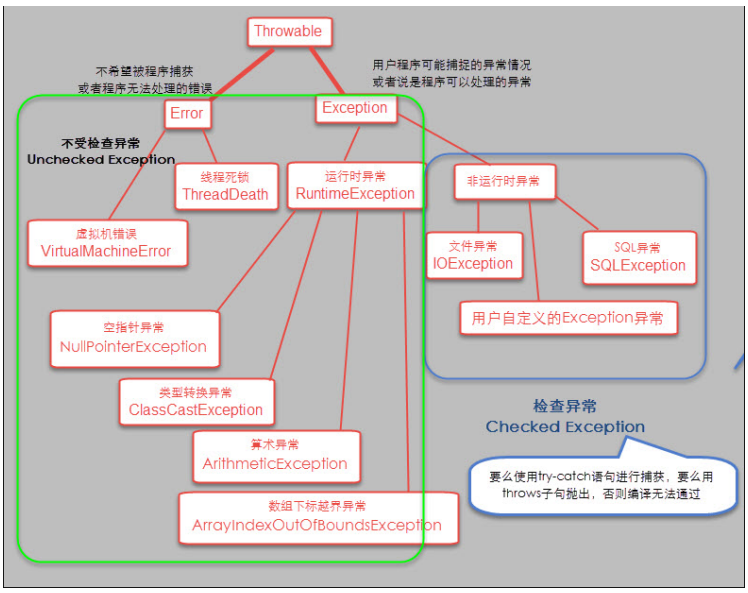
