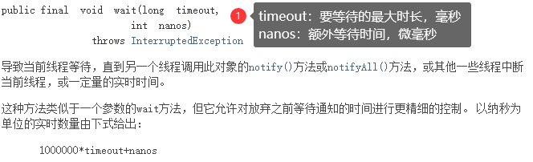
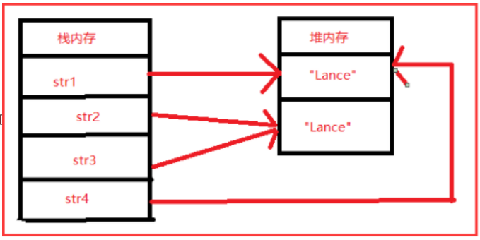
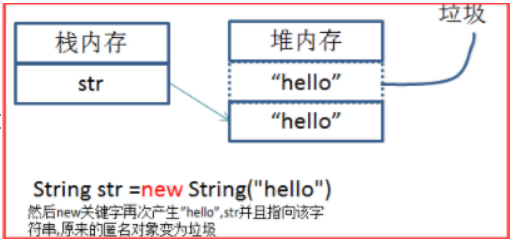
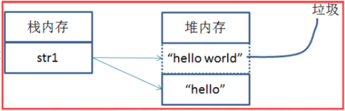
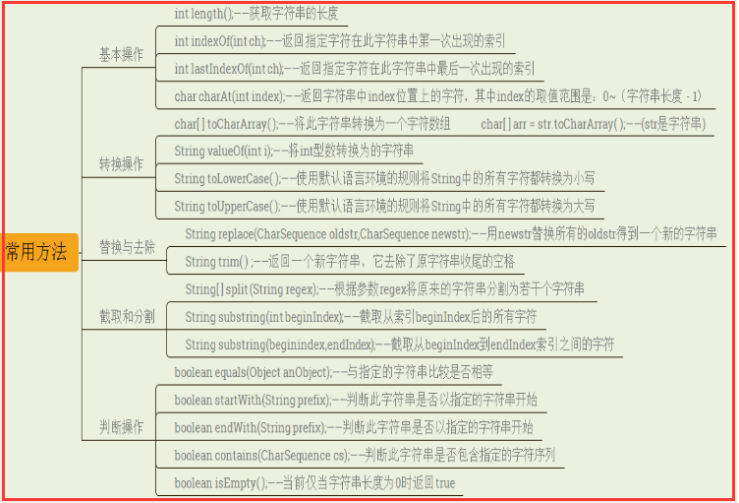
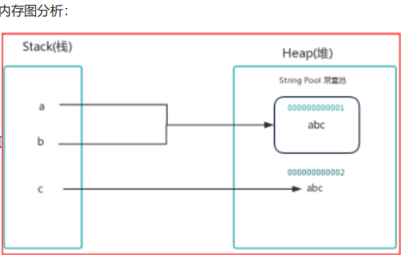
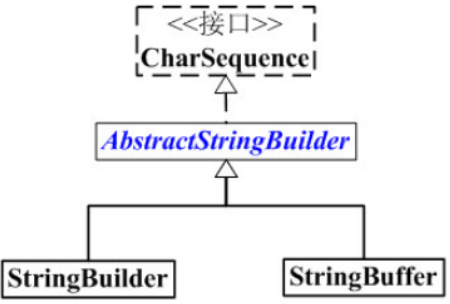

# 常用类

## Object类

大家都知道Object是所有类的父类，任何类都默认继承Object。 

理论上Object类是所有类的父类，即直接或间接的继承java.lang.Object类。 

由于所有的类都继承在Object类，因此省略了extends Object关键字。 

该类中主要有以下方法:

-  toString() 
-  getClass() 
-  equals() 
-  clone() 
-  finalize()
-  其中toString(),getClass(),equals是其中最重要的方法。

### clone() 方法

```java
protected native Object clone() throws CloneNotSupportedException;
```

clone顾名思义就是复制， 在Java语言中， clone方法被对象调用，所以会复制对象。所谓的复制对象， 首先要分配一个和源对象同样大小的空间，在这个空间中创建一个新的对象。那么在java语言中，有几种方式可以创建对象呢？ 

- 使用new操作符创建一个对象 
- 使用clone方法复制一个对象 

那么这两种方式有什么相同和不同呢？ 

new操作符的本意是分配内存。程序执行到new操作符时， 首先去看new操作符后面的类型，因为知道了类型，才能知道要分配多大的内存空间。分配完内存之后， 再调用构造函数，填充对象的各个域，这一步叫做对象的初始化，构造方法返回后，一个对象创建完毕，可以把他的引用（地址）发布到外部，在外部就可以使用这个引用操纵这个对象。而clone在第一步是和new相似的， 都是分配内存，调用clone方法时，分配的内存和源对象（即调用clone方法的对象） 相同，然后再使用原对象中对应的各个域，填充新对象的域， 填充完成之后，clone方法返回，一个新的相同的对象被创建，同样可以把这个新对象的引用发布到外部。

**clone与copy的区别**

假设现在有一个Employee对象

```java
Employee tobby =new Employee(“CMTobby”,5000) 
```

通常我们会有这样的赋值Employee cindyelf=tobby，这个时候只是简单了copy了一下reference， cindyelf和tobby都指向内存中同一个object，这样**cindyelf或者tobby**的一个操作都可能**影响到对方**。

打个比方，如果我们通过cindyelf.raiseSalary()方法改变了salary域的值，那么tobby通过getSalary()方法 得到的就是修改之后的salary域的值，显然这不是我们愿意看到的。

我们希望得到tobby的一个精确拷贝，同时两者互不影响，这时候， 我们就可以使用Clone来满足我们的需求。**Employee cindy=tobby.clone()**，这时会生成一个新的Employee对象，并且和tobby具有相同的属性值和方法。

**Shallow Clone与Deep Clone**

主要是JAVA里除了8种基本类型传参数是值传递，其他的类对象传参数都是引用，我们有时候不希望在 方法里将参数改变，这是就需要在类中复写clone方法（实现深复制）。 

Clone是如何完成的呢？Object在对某个对象实施Clone时对其是一无所知的，它仅仅是简单地执行域 对域的copy，这就是**Shallow Clone（浅克隆）**。这样，问题就来了咯。 以Employee为例，它里面有一个域hireDay不是基本数据类型的变量，而是一个reference变量，经过 Clone之后就会产生一个新的Date型的reference， 它和原始对象中对应的域指向同一个Date对象，这样克隆类就和原始类共享了一部分信息，而这样显然是不利的，过程下图所示：


这个时候我们就需要进行**deep Clone（深克隆）**了，对那些非基本类型的域进行特殊的处理，例如本例中的 hireDay。我们可以重新定义Clone方法，对hireDay做特殊处理，如下代码所示：

```java
class Employee implements Cloneable {
    public Object clone() throws CloneNotSupportedException {
        Employee cloned = (Employee) super.clone();
        cloned.hireDay = (Date) hireDay.clone()
        return cloned;
    }
}
```

**clone方法的保护机制**

Object做不到深拷贝，因为它不知道自定义的类里有哪些引用类型，在Object中Clone()是被声明为protected的，这样做是有一定的道理的。

以Employee类为例，通过声明 为protected，这样想要在其他任何地方调用这个类的clone方法，这个类就必须去重写clone方法。

而如果不重写就调用，则会编译失败。

```java
Class Person implements Cloneable{
}

Class Test{
    public void main(String [] args) throws ClontNotSupportedException{
        Person person =new Person();
        person.clone();          //编译错误（Object类型的clone方法不可见）
    }
}

Class Person implements Cloneable{
    @Override
    protected Object clone() throws CloneNotSupportedException {
        return super.clone();
    }
}

 Class Test{
     public void main(String [] args) throws ClontNotSupportedException{
         Person person =new Person();
         person.clone();          //编译通过
     }
}

```

**clone方法的使用**

什么时候使用shallow Clone，什么时候使用deep Clone，这个主要看具体对象的域是什么性质的，基本类型还是reference variable 

调用Clone()方法的对象所属的类(Class)必须implements Clonable接口，否则在调用Clone方法的时候会抛出CloneNotSupportedException

### toString()方法

```java
public String toString() {
	return getClass().getName() + "@" + Integer.toHexString(hashCode());
}
```

Object 类的 toString 方法返回一个字符串，该字符串由类名（对象是该类的一个实例）、at 标记符“@” 和此对象哈希码的无符号十六进制表示组成。 

该方法用得比较多，一般子类都有覆盖。

### getClass()方法

```java
public final native Class<?> getClass();
```

返回次Object的运行时类类型。 

不可重写，要调用的话，一般和getName()联合使用，如getClass().getName();

```java
public static void main(String[] args) {
    Object o = new Object();
    System.out.println(o.getClass());
    //class java.lang.Object
}
```

### finalize()方法

```java
protected void finalize() throws Throwable { }
```

该方法用于释放资源。因为无法确定该方法什么时候被调用，很少使用。 

Java允许在类中定义一个名为finalize()的方法。它的工作原理是：一旦垃圾回收器准备好释放对象占用的存储空间，将首先调用其finalize()方法。并且在下一次垃圾回收动作发生时，才会真正回收对象占用 的内存。 

关于垃圾回收，有三点需要记住： 

1. 对象可能不被垃圾回收。只要程序没有濒临存储空间用完的那一刻，对象占用的空间就总也得不到释放。 
2. 垃圾回收并不等于“析构”。 【科普：析构函数(destructor) 与构造函数相反，当对象结束其生命周期，如对象所在的函数已调用完毕时，系统自动执行析构函数。析构函数往往用来做“清理善后” 的工作（例如在建立对象时用new开辟 了一片内存空间，delete会自动调用析构函数后释放内存）。】 
3. 垃圾回收只与内存有关。使用垃圾回收的唯一原因是为了回收程序不再使用的内存。 

**finalize()的用途：** 

无论对象是如何创建的，垃圾回收器都会负责释放对象占据的所有内存。 

这就将对finalize()的需求限制到一种特殊情况，即通过某种创建对象方式以外的方式为对象分配了存储空间。不过这种情况一般发生在使用“本地方法”的情况下，本地方法是一种在Java中调用非Java代码的方式。

### equals()方法

```java
public boolean equals(Object obj) {
	return (this == obj);
}
```

Object中的equals方法是直接判断this和obj本身的值是否相等，即用来判断调用equals的对象和形参 obj所引用的对象是否是同一对象

所谓同一对象就是指内存中同一块存储单元，如果this和obj指向的hi同一块内存对象，则返回true,如果 this和obj指向的不是同一块内存，则返回false。

 **注意：**

即便是内容完全相等的两块不同的内存对象，也返回false。 如果是同一块内存，则object中的equals方法返回true,如果是不同的内存，则返回false 。

如果希望不同内存但相同内容的两个对象equals时返回true,则我们需要重写父类的equal方法 String类已经重写了object中的equals方法（这样就是比较内容是否相等了）

```java
//String类源码equals方法
public boolean equals(Object anObject) {
    if (this == anObject) {
        return true;
    }
    if (anObject instanceof String) {
        String anotherString = (String)anObject;
        int n = value.length;
        if (n == anotherString.value.length) {
            char v1[] = value;
            char v2[] = anotherString.value;
            int i = 0;
            while (n-- != 0) {
                if (v1[i] != v2[i])
                    return false;
                i++;
            }
            return true;
        }
    }
    return false;
}
```

### hashCode()方法

```java
public native int hashCode();
```

返回该对象的哈希码值。 该方法用于哈希查找，可以减少在查找中使用equals的次数，重写了equals方法一般都要重写 hashCode方法。这个方法在一些具有哈希功能的Collection中用到。

 一般必须满足**obj1.equals(obj2)==true**。可以推出**obj1.hash Code() == obj2.hashCode()**，但是**hashCode相等不一定就满足equals**。不过为了提高效率，应该尽量使上面两个条件接近等价。

### wait()方法

```java
public final void wait() throws InterruptedException {
	wait(0);
}

public final native void wait(long timeout) throws InterruptedException;

public final void wait(long timeout, int nanos) throws InterruptedException
{
    if (timeout < 0) {
    	throw new IllegalArgumentException("timeout value is negative");
    }
    if (nanos < 0 || nanos > 999999) {
    	throw new IllegalArgumentException("nanosecond timeout value out of range");
    }
    if (nanos > 0) {
    	timeout++;
    }
    wait(timeout);
}
```



wait方法就是使当前线程等待该对象的锁，当前线程必须是该对象的拥有者，也就是具有该对象的锁。 wait()方法一直等待，直到获得锁或者被中断。wait(long timeout)设定一个超时间隔

 如果在规定时间内没有获得锁就返回。 

调用该方法后当前线程进入睡眠状态，直到以下事件发生。 

1. 其他线程调用了该对象的notify方法。 
2. 其他线程调用了该对象的notifyAll方法。 
3. 其他线程调用了interrupt中断该线程。 
4. 时间间隔到了。 

此时该线程就可以被调度了，如果是被中断的话就抛出一个InterruptedException异常。

### notify()方法

```java
//该方法唤醒在该对象上等待的某个线程。
public final native void notify();
//该方法唤醒在该对象上等待的所有线程。
public final native void notifyAll();
```

## 包装类

### 介绍

虽然 Java 语言是典型的面向对象编程语言，但其中的八种基本数据类型并不支持面向对象编程，基本类 型的数据不具备“对象”的特性——不携带属性、没有方法可调用。 沿用它们只是为了迎合人类根深蒂固的习惯，并的确能简单、有效地进行常规数据处理。 

这种借助于非面向对象技术的做法有时也会带来不便，比如引用类型数据均继承了 Object 类的特性，要转换为 String 类型（经常有这种需要）时只要简单调用 Object 类中定义的toString()即可，而基本数据类型转换为 String 类型则要麻烦得多。为解决此类问题 ，Java为每种基本数据类型分别设计了对应的类，称之为**包装类**(Wrapper Classes)，也有教材称为**外覆类或数据类型类**。

| 基本数据类型 | 对应的包装类 |
| ------------ | ------------ |
| byte         | Byte         |
| short        | Short        |
| int          | Integer      |
| long         | Long         |
| char         | Character    |
| float        | Float        |
| double       | Double       |
| boolean      | Boolean      |

每个包装类的对象可以封装一个相应的基本类型的数据，并提供了其它一些有用的方法。包装类对象一 经创建，其内容（所封装的基本类型数据值）不可改变。 

基本类型和对应的包装类可以相互装换： 

- 由基本类型向对应的包装类转换称为装箱，例如把 int 包装成 Integer 类的对象； 

- 包装类向对应的基本类型转换称为拆箱，例如把 Integer 类的对象重新简化为 int。

### 应用

1. 实现 int 和 Integer 的相互转换

   ```java
   //可以通过 Integer 类的构造方法将 int 装箱，通过 Integer 类的 intValue 方法将 Integer 拆箱。
   public static void main(String[] args) {
       int m = 500;
       Integer obj = new Integer(m); // 手动装箱
       int n = obj.intValue(); // 手动拆箱
       System.out.println("n = " + n);
       Integer obj1 = new Integer(500);
       System.out.println("obj 等价于 obj1？" + obj.equals(obj1));
   }
   
   //结果
   n = 500
   obj 等价于 obj1？true
   ```

2. 将字符串转换为整数

   ```java
   //parseInt(String s, int radix);
   //s 为要转换的字符串，radix 为进制，可选，默认为十进制。
   
   public static void main(String[] args) {
       String[] str = {"123", "123abc", "abc123", "abcxyz"};
       for(String str1 : str){
           try{
               int m = Integer.parseInt(str1, 10);
               System.out.println(str1 + " 可以转换为整数 " + m);
           }catch(Exception e){
           	System.out.println(str1 + " 无法转换为整数");
           }
       }
   }
   
   //结果
   123 可以转换为整数 123
   123abc 无法转换为整数
   abc123 无法转换为整数
   abcxyz 无法转换为整数
   ```

3. 将整数转换为字符串

   ```java
   public static void main(String[] args) {
       int m = 500;
       String s = Integer.toString(m);
       String s2 = m+"";
       System.out.println("s = " + s);
   }
   ```

### 自动拆箱和装箱

上面的例子都需要手动实例化一个包装类，称为手动拆箱装箱。Java 1.5(5.0) 之前必须手动拆箱装箱。 

Java 1.5 之后可以自动拆箱装箱，也就是在进行基本数据类型和对应的包装类转换时，系统将自动进 行，这将大大方便程序员的代码书写。

```java
public static void main(String[] args) {
    int m = 500;
    Integer obj = m; // 自动装箱
    int n = obj; // 自动拆箱
    System.out.println("n = " + n);
    Integer obj1 = 500;
    System.out.println("obj 等价于 obj1？" + obj.equals(obj1));
}

//结果
n = 500
obj 等价于 obj1？true
```

自动装箱与拆箱的功能事实上是编译器来帮您的忙，编译器在编译时期依您所编写的语法，决定是否进行装箱或拆箱动作。例如：

```java
Integer i = 100;
//相当于编译器自动为您作以下的语法编译：
Integer i = new Integer(100);
```

所以自动装箱与拆箱的功能是所谓的“编译器蜜糖”(Compiler Sugar)，虽然使用这个功能很方便，但在程 序运行阶段您得了解Java的语义。例如下面的程序是可以通过编译的：

```java
Integer i = null;
int j = i;
```

这样的语法在编译时期是合法的，但是在运行时期会有错误，因为这种写法相当于：

```java
Integer i = null;
int j = i.intValue();
```

null表示i 没有参考至任何的对象实体，它可以合法地指定给对象参考名称。由于实际上i并没有参考至任何的对象，所以也就不可能操作intValue()方法，这样上面的写法在运行时会出现NullPointerException 错误。 

自动拆箱装箱是常用的一个功能，需要重点掌握。 

一般地，当需要使用数字的时候，我们通常使用内置数据类型，如：**byte、int、long、double** 等。然而，在实际开发过程中，我们经常会遇到需要使用对象，而不是内置数据类型的情形。为了解决这个问 题，Java 语言为每一个内置数据类型提供了对应的包装类。 所有的包装类（I**nteger、Long、Byte、Double、Float、Short**）都是**抽象类 Number 的子类**。

## Math类

```java
public static void main(String[] args) {
    /**
    *Math.sqrt()//计算平方根
    *Math.cbrt()//计算立方根
    *Math.pow(a, b)//计算a的b次方
    *Math.max( , );//计算最大值
    *Math.min( , );//计算最小值
    */
    System.out.println(Math.sqrt(16)); //4.0
    System.out.println(Math.cbrt(8)); //2.0
    System.out.println(Math.pow(3,2)); //9.0
    System.out.println(Math.max(2.3,4.5));//4.5
    System.out.println(Math.min(2.3,4.5));//2.3
    /**
    * abs求绝对值
    */
    System.out.println(Math.abs(-10.4)); //10.4
    System.out.println(Math.abs(10.1)); //10.1
    /**
    * ceil天花板的意思，就是返回大的值
    */
    System.out.println(Math.ceil(-10.1)); //-10.0
    System.out.println(Math.ceil(10.7)); //11.0
    System.out.println(Math.ceil(-0.7)); //-0.0
    System.out.println(Math.ceil(0.0)); //0.0
    System.out.println(Math.ceil(-0.0)); //-0.0
    System.out.println(Math.ceil(-1.7)); //-1.0
    /**
    * floor地板的意思，就是返回小的值
    */
    System.out.println(Math.floor(-10.1)); //-11.0
    System.out.println(Math.floor(10.7)); //10.0
    System.out.println(Math.floor(-0.7)); //-1.0
    System.out.println(Math.floor(0.0)); //0.0
    System.out.println(Math.floor(-0.0)); //-0.0
    /**
    * random 取得一个大于或者等于0.0 小于不等于1.0的随机数 [0,1)
    */
    System.out.println(Math.random()); //小于1大于0的double类型的数
    System.out.println(Math.random()+1);//大于1小于2的double类型的数
    /**
    * rint 四舍五入，返回double值
    * 注意.5的时候会取偶数 异常的尴尬=。=
    */
    System.out.println(Math.rint(10.1)); //10.0
    System.out.println(Math.rint(10.7)); //11.0
    System.out.println(Math.rint(11.5)); //12.0
    System.out.println(Math.rint(10.5)); //10.0
    System.out.println(Math.rint(10.51)); //11.0
    System.out.println(Math.rint(-10.5)); //-10.0
    System.out.println(Math.rint(-11.5)); //-12.0
    System.out.println(Math.rint(-10.51)); //-11.0
    System.out.println(Math.rint(-10.6)); //-11.0
    System.out.println(Math.rint(-10.2)); //-10.0
    /**
    * round 四舍五入，float时返回int值，double时返回long值
    */
    System.out.println(Math.round(10.1)); //10
    System.out.println(Math.round(10.7)); //11
    System.out.println(Math.round(10.5)); //11
    System.out.println(Math.round(10.51)); //11
    System.out.println(Math.round(-10.5)); //-10
    System.out.println(Math.round(-10.51)); //-11
    System.out.println(Math.round(-10.6)); //-11
    System.out.println(Math.round(-10.2)); //-10
}
```

## Random类

### java.lang.Math.Random

调用这个Math.Random()函数能够返回带正号的double值，该值大于等于0.0且小于1.0，即取值范围是 [0.0,1.0)的左闭右开区间，返回值是一个伪随机选择的数，在该范围内（近似）均匀分布。例子如下：

```java
public static void main(String[] args) {
    // 结果是个double类型的值，区间为[0.0,1.0）
    System.out.println("Math.random()=" + Math.random());
    int num = (int) (Math.random() * 3);
    // 注意不要写成(int)Math.random()*3，这个结果为0或1，因为先执行了强制转换
    System.out.println("num=" + num);
}

//结果
//Math.random()=0.44938147153848396
//num=1
```

### java.util.Random

下面是Random()的两种构造方法：

Random()：创建一个新的随机数生成器。 

Random(long seed)：使用单个 long 种子创建一个新的随机数生成器。 你在创建一个Random对象的时候可以给定任意一个合法的种子数，种子数只是随机算法的起源数字， 和生成的随机数的区间没有任何关系。

```java
//在没带参数构造函数生成的Random对象的种子缺省是当前系统时间的毫秒数。
//rand.nextInt(100)中的100是随机数的上限,产生的随机数为0-100的整数,不包括100。
public static void main(String[] args) {
    Random rand =new Random();
    int i=rand.nextInt(100);
    System.out.println(i);
}
//结果,多次结果不同
//73

对于种子相同的Random对象，生成的随机数序列是一样的。
public static void main(String[] args) {
    Random ran1 = new Random(25);
    System.out.println("使用种子为25的Random对象生成[0,100)内随机整数序列: ");
    for (int i = 0; i < 10; i++) {
        System.out.print(ran1.nextInt(100) + " ");
    }
    System.out.println();
}
//结果
//使用种子为25的Random对象生成[0,100)内随机整数序列: 
//81 28 47 38 97 98 95 37 96 54 
```

#### 方法摘要

1.  protected int next(int bits)：生成下一个伪随机数。 
2.  boolean nextBoolean()：返回下一个伪随机数，它是取自此随机数生成器序列的均匀分布的 boolean值。 
3.  void nextBytes(byte[] bytes)：生成随机字节并将其置于用户提供的 byte 数组中。 
4.  double nextDouble()：返回下一个伪随机数，它是取自此随机数生成器序列的、在0.0和1.0之间 均匀分布的 double值。 
5.  float nextFloat()：返回下一个伪随机数，它是取自此随机数生成器序列的、在0.0和1.0之间均匀分 布float值。 
6.  double nextGaussian()：返回下一个伪随机数，它是取自此随机数生成器序列的、呈高斯（“正态”）分布的double值，其平均值是0.0标准差是1.0。 
7.  int nextInt()：返回下一个伪随机数，它是此随机数生成器的序列中均匀分布的 int 值。 
8.  int nextInt(int n)：返回一个伪随机数，它是取自此随机数生成器序列的、在（包括和指定值（不 包括）之间均匀分布的int值。 
9.  long nextLong()：返回下一个伪随机数，它是取自此随机数生成器序列的均匀分布的 long 值。 
10.  void setSeed(long seed)：使用单个 long 种子设置此随机数生成器的种子。

**示例：**

1. 生成[0,1.0)区间的小数：double d1 = r.nextDouble(); 
2. 生成[0,5.0)区间的小数：double d2 = r.nextDouble() * 5; 
3. 生成[1,2.5)区间的小数：double d3 = r.nextDouble() * 1.5 + 1; 
4. 生成[0,10)区间的整数：int n2 = r.nextInt(10);

## 日期时间类

### Date类

java.util 包提供了 Date 类来封装当前的日期和时间。 

Date 类提供两个构造函数来实例化 Date 对象。 

第一个构造函数使用当前日期和时间来初始化对象。

第二个构造函数接收一个参数，该参数是从1970年1月1日起的毫秒数。

```java
Date()
Date(long millisec)
```

**方法**

| 序 号 | 方法和描述                                                   |
| ----- | ------------------------------------------------------------ |
| 1     | **boolean after(Date date)** 若当调用此方法的Date对象在指定日期之后返回true,否则返回 false。 |
| 2     | **boolean before(Date date)** 若当调用此方法的Date对象在指定日期之前返回true,否则返 回false。 |
| 3     | **Object clone( )** 返回此对象的副本。                       |
| 4     | **int compareTo(Date date)** 比较当调用此方法的Date对象和指定日期。两者相等时候返回 0。调用对象在指定日期之前则返回负数。调用对象在指定日期之后则返回正数。 |
| 5     | **int compareTo(Object obj)** 若obj是Date类型则操作等同于compareTo(Date) 。否则它抛 出ClassCastException。 |
| 6     | **boolean equals(Object date)** 当调用此方法的Date对象和指定日期相等时候返回true,否则返回false。 |
| 7     | **long getTime( )** 返回自 1970 年 1 月 1 日 00:00:00 GMT 以来此 Date 对象表示的毫秒数。 |
| 8     | **int hashCode( )** 返回此对象的哈希码值。                   |
| 9     | **void setTime(long time)** 用自1970年1月1日00:00:00 GMT以后time毫秒数设置时间和日 期。 |
| 10    | **String toString( )** 把此 Date 对象转换为以下形式的 String： dow mon dd hh:mm:ss zzz yyyy 其中： dow 是一周中的某一天 (Sun, Mon, Tue, Wed, Thu, Fri, Sat)。 |

```java
public static void main(String args[]) {
    // 初始化 Date 对象
    Date date = new Date();
    
    // 使用 toString() 函数显示日期时间
    System.out.println(date.toString());
    //Sat Apr 27 15:09:43 CST 2019
    
    //getTime
    long time = date.getTime();
	long time2 = date.getTime();
	System.out.println(time==time2);  //true
	
	boolean before = new Date(97, 01, 05).before(new Date(99, 11, 16));
	System.out.println(before);  //true
}
```

### SimpleDateFormat

SimpleDateFormat 是一个以语言环境敏感的方式来格式化和分析日期的类。SimpleDateFormat 允许你选择任何用户自定义日期时间格式来运行。例如：

```java
public static void main(String args[]) {
    Date dNow = new Date( );
    SimpleDateFormat ft = new SimpleDateFormat ("yyyy-MM-dd hh:mm:ss");
    System.out.println("当前时间为: " + ft.format(dNow));
}
```

其中 yyyy 是完整的公元年，MM 是月份，dd 是日期，HH:mm:ss 是时、分、秒。 

**注意**:有的格式大写，有的格式小写，例如 MM 是月份，mm 是分；HH 是 24 小时制，而 hh 是 12 小时 制。

### Calendar类

我们现在已经能够格式化并创建一个日期对象了，但是我们如何才能设置和获取日期数据的特定部分呢，比如说小时，日，或者分钟? 我们又如何在日期的这些部分加上或者减去值呢? 答案是使用Calendar 类。

Date中有很多方法都已经废弃了！ Calendar类的功能要比Date类强大很多，而且在实现方式上也比Date类要复杂一些。 

Calendar类是一个抽象类，在实际使用时实现特定的子类的对象，创建对象的过程对程序员来说是透明 的，只需要使用getInstance方法创建即可。

```java
public static void main(String args[]) {
    Calendar c = Calendar.getInstance();//默认是当前日期
    System.out.println(c);
}
//输出
java.util.GregorianCalendar[time=1656066899066,areFieldsSet=true,areAllFieldsSet=true,lenient=true,zone=sun.util.calendar.ZoneInfo[id="Asia/Shanghai",offset=28800000,dstSavings=0,useDaylight=false,transitions=19,lastRule=null],firstDayOfWeek=1,minimalDaysInFirstWeek=1,ERA=1,YEAR=2022,MONTH=5,WEEK_OF_YEAR=26,WEEK_OF_MONTH=4,DAY_OF_MONTH=24,DAY_OF_YEAR=175,DAY_OF_WEEK=6,DAY_OF_WEEK_IN_MONTH=4,AM_PM=1,HOUR=6,HOUR_OF_DAY=18,MINUTE=34,SECOND=59,MILLISECOND=66,ZONE_OFFSET=28800000,DST_OFFSET=0]
```

**字段**

```java
// 获得年份
int year = c1.get(Calendar.YEAR);
// 获得月份
int month = c1.get(Calendar.MONTH) + 1;
// 获得日期
int date = c1.get(Calendar.DATE);
// 获得小时
int hour = c1.get(Calendar.HOUR_OF_DAY);
// 获得分钟
int minute = c1.get(Calendar.MINUTE);
// 获得秒
int second = c1.get(Calendar.SECOND);
// 获得星期几（注意（这个与Date类是不同的）：1代表星期日、2代表星期1、3代表星期二，以此类
推）
int day = c1.get(Calendar.DAY_OF_WEEK);
```

**方法**

- Calendar.set(),设置年月日等
- Calendar.get(),获取年月日等
- Calendar.add(),日期加n天或减n天

**注意：Calender的月份是从0开始的，但日期和年份是从1开始的**

```java
public static void main(String[] args) {
    Calendar c1 = Calendar.getInstance();
    c1.set(2017, 1, 1);
    System.out.println(c1.get(Calendar.YEAR)
                       +"-"+c1.get(Calendar.MONTH)
                       +"-"+c1.get(Calendar.DATE));
    c1.set(2017, 1, 0);
    System.out.println(c1.get(Calendar.YEAR)
                       +"-"+c1.get(Calendar.MONTH)
                       +"-"+c1.get(Calendar.DATE));
}
//输出
2017-1-1
2017-0-31

public static void main(String[] args) {
    Calendar c1 = Calendar.getInstance();
    c1.set(2017, 2, 1);
    System.out.println(c1.get(Calendar.YEAR)
                       +"-"+c1.get(Calendar.MONTH)
                       +"-"+c1.get(Calendar.DATE));
    c1.set(2017, 2, 0);
    System.out.println(c1.get(Calendar.YEAR)
                       +"-"+c1.get(Calendar.MONTH)
                       +"-"+c1.get(Calendar.DATE));
}
//输出
2017-2-1
2017-1-28    
```

## String类

```java
public final class String
	implements java.io.Serializable, Comparable<String>, CharSequence {
}
```

### 成员变量

```java
//String的属性值
private final char value[];
//数组被使用的开始位置
private final int offset;
//String中元素的个数
private final int count;
//String类型的hash值
private int hash; // Default to 0
private static final long serialVersionUID = -6849794470754667710L;
private static final ObjectStreamField[] serialPersistentFields =
new ObjectStreamField[0];
```

从源码看出String底层使用一个字符数组来维护的。

成员变量可以知道String类的值是final类型的，不能被改变的，所以只要一个值改变就会生成一个新的 String类型对象，存储String数据也不一定从数组的第0个元素开始的，而是从offset所指的元素开始。

### 构造方法

```java
String()
//初始化一个新创建的 String 对象，使其表示一个空字符序列。
String(byte[] bytes)
//通过使用平台的默认字符集解码指定的 byte 数组，构造一个新的 String。
String(byte[] bytes, Charset charset)
//通过使用指定的 charset 解码指定的 byte 数组，构造一个新的 String。
String(byte[] bytes, int offset, int length)
//通过使用平台的默认字符集解码指定的 byte 子数组，构造一个新的 String。
String(byte[] bytes, int offset, int length, Charset charset)
//通过使用指定的 charset 解码指定的 byte 子数组，构造一个新的 String。
String(byte[] bytes, int offset, int length, String charsetName)
//通过使用指定的字符集解码指定的 byte 子数组，构造一个新的 String。
String(byte[] bytes, String charsetName)
//通过使用指定的 charset 解码指定的 byte 数组，构造一个新的 String。
String(char[] value)
//分配一个新的 String，使其表示字符数组参数中当前包含的字符序列。
String(char[] value, int offset, int count)
//分配一个新的 String，它包含取自字符数组参数一个子数组的字符。
String(int[] codePoints, int offset, int count)
//分配一个新的 String，它包含 Unicode 代码点数组参数一个子数组的字符。
String(String original)
//初始化一个新创建的 String 对象，使其表示一个与参数相同的字符序列；换句话说，新创建
的字符串是该参数字符串的副本。
String(StringBuffer buffer)
//分配一个新的字符串，它包含字符串缓冲区参数中当前包含的字符序列。
String(StringBuilder builder)
//分配一个新的字符串，它包含字符串生成器参数中当前包含的字符序列。
```

### 创建方式

直接赋值方式创建对象是在方法区的常量池 

```java
String str="hello";//直接赋值的方式
```

通过构造方法创建字符串对象是在堆内存

```java
String str=new String("hello");//实例化的方式
```

#### 比较

```java
public static void main(String[] args) {
    String str1 = "Lance";
    String str2 = new String("Lance");
    String str3 = str2; //引用传递，str3直接指向st2的堆内存地址
    String str4 = "Lance";
    /**
    * ==:
    * 基本数据类型：比较的是基本数据类型的值是否相同
    * 引用数据类型：比较的是引用数据类型的地址值是否相同
    * 所以在这里的话：String类对象==比较，比较的是地址，而不是内容
    */
    System.out.println(str1==str2);//false
    System.out.println(str1==str3);//false
    System.out.println(str3==str2);//true
    System.out.println(str1==str4);//true
}
```

**内存分析**



可能这里还是不够明显，构造方法实例化方式的内存图：String str = new String("Hello");

首先：


当我们再一次的new一个String对象时：



#### **字符串常量池**

在字符串中，如果采用直接赋值的方式（String str="Lance"）进行对象的实例化，则会将匿名对象 “Lance”放入对象池，每当下一次对不同的对象进行直接赋值的时候会直接利用池中原有的匿名对象，我 们可以用对象手工入池；

```java
public static void main(String args[]){
    String str =new String("Lance").intern();//对匿名对象"Lance"进行手工入池操作
    String str1="Lance";
    System.out.println(str==str1);//true
}
```

#### **区别**

1. 直接赋值（String str = "hello"）：只开辟一块堆内存空间，并且会自动入池，不会产生垃圾。 
2. 构造方法（String str= new String("hello");）:会开辟两块堆内存空间，其中一块堆内存会变成垃圾被系统回收，而且不能够自动入池，需要通过public String intern();方法进行手工入池。 
3. **在开发的过程中不会采用构造方法进行字符串的实例化**。

#### 避免空指向

首先了解： == 和public boolean equals()比较字符串的区别 

==在对字符串比较的时候，对比的是内存地址，而equals比较的是字符串内容，在开发的过程中， equals()通过接受参数，可以避免空指向。

```java
String str = null;
if(str.equals("hello")){//此时会出现空指向异常
	...
}
if("hello".equals(str)){//此时equals会处理null值，可以避免空指向异常
	...
}
```

String类对象一旦声明则不可以改变；而改变的只是地址，原来的字符串还是存在的，并且产生垃圾



### String常用的方法



#### String的判断

```java
public static void main(String[] args) {
    // 创建字符串对象
    String s1 = "hello";
    String s2 = "hello";
    String s3 = "Hello";
    // boolean equals(Object obj):比较字符串的内容是否相同
    System.out.println(s1.equals(s2)); //true
    System.out.println(s1.equals(s3)); //false
    System.out.println("-----------");
    // boolean equalsIgnoreCase(String str):比较字符串的内容是否相同,忽略大小写
    System.out.println(s1.equalsIgnoreCase(s2)); //true
    System.out.println(s1.equalsIgnoreCase(s3)); //true
    System.out.println("-----------");
    // boolean startsWith(String str):判断字符串对象是否以指定的str开头
    System.out.println(s1.startsWith("he")); //true
    System.out.println(s1.startsWith("ll")); //false
     // boolean endsWith(String str):判断字符串对象是否以指定的str结尾
    System.out.println(s1.endsWith("lo")); //true
    System.out.println(s1.endsWith("ll")); //false
}
```

#### String的截取

```java
public static void main(String args[]) {
    // 创建字符串对象
    String s = "helloworld";
    // int length():获取字符串的长度，其实也就是字符个数
    System.out.println(s.length()); //10
    System.out.println("--------");
    // char charAt(int index):获取指定索引处的字符
    System.out.println(s.charAt(0)); //h
    System.out.println(s.charAt(1)); //e
    System.out.println("--------");
    // int indexOf(String str):获取str在字符串对象中第一次出现的索引
    System.out.println(s.indexOf("l")); //2
    System.out.println(s.indexOf("owo")); //4
    System.out.println(s.indexOf("ak")); //-1
    System.out.println("--------");
    // String substring(int start):从start开始截取字符串
    System.out.println(s.substring(0)); //helloworld
    System.out.println(s.substring(5)); //world
    System.out.println("--------");
    // String substring(int start,int end):从start开始，到end结束截取字符串
    System.out.println(s.substring(0, s.length())); //helloworld
    System.out.println(s.substring(3, 8)); //lowor
}
```

#### String的转换

```java
public static void main(String args[]) {
    // 创建字符串对象
    String s = "abcde";
    // char[] toCharArray():把字符串转换为字符数组
    char[] chs = s.toCharArray();
    for (int x = 0; x < chs.length; x++) {
    	System.out.println(chs[x]);
    }
    System.out.println("-----------");  //a b c d e
    // String toLowerCase():把字符串转换为小写字符串
    System.out.println("HelloWorld".toLowerCase());  //helloworld
    // String toUpperCase():把字符串转换为大写字符串
    System.out.println("HelloWorld".toUpperCase());  //HELLOWORLD
}
```

#### 其他方法

```java
public static void main(String args[]) {
    // 创建字符串对象
    String s1 = "helloworld";
    String s2 = " helloworld ";
    String s3 = " hello world ";
    System.out.println("---" + s1 + "---");//---helloworld---
    System.out.println("---" + s1.trim() + "---");//---helloworld---
    System.out.println("---" + s2 + "---");//--- helloworld ---
    System.out.println("---" + s2.trim() + "---");//---helloworld---
    System.out.println("---" + s3 + "---");//--- hello world ---
    System.out.println("---" + s3.trim() + "---");//---hello world---
    System.out.println("-------------------");
    // String[] split(String str)
    // 创建字符串对象
    String s4 = "aa,bb,cc";
    String[] strArray = s4.split(",");
    for (int x = 0; x < strArray.length; x++) {
    	System.out.println(strArray[x]);  //aa  bb  cc
    }
}
```

### String的不可变性

当我们去阅读源代码的时候，会发现有这样的一句话：

```java
Strings are constant; their values cannot be changed after they are created.
```

意思就是说：String是个常量，从一出生就注定不可变。

我想大家应该就知道为什么String不可变了，String类被final修饰，官方注释说明创建后不能被改变，但 是为什么String要使用final修饰呢？

```java
public static void main(String[] args) {
    String a = "abc";
    String b = "abc";
    String c = new String("abc");
    System.out.println(a==b); //true
    System.out.println(a.equals(b)); //true
    System.out.println(a==c); //false
    System.out.println(a.equals(c)); //true
}
```



因为String太过常用，JAVA类库的设计者在实现时做了个小小的变化，即采用了享元模式,每当生成一个新内容的字符串时，他们都被添加到一个共享池中，当第二次再次生成同样内容的字符串实例时，就共享此对象，而不是创建一个新对象，但是这样的做法仅仅适合于通过=符号进行的初始化。 

需要说明一点的是，在object中，equals()是用来比较内存地址的，但是String重写了equals()方 法，用来比较内容的，即使是不同地址，只要内容一致，也会返回true，这也就是为什么a.equals(c)返 回true的原因了。

**好处**

- 可以实现多个变量引用堆内存中的同一个字符串实例，避免创建的开销。 
- 我们的程序中大量使用了String字符串，有可能是出于安全性考虑。 
- 大家都知道HashMap中key为String类型，如果可变将变的多么可怕。 
- 当我们在传参的时候，使用不可变类不需要去考虑谁可能会修改其内部的值，如果使用可变类的话，可能需要每次记得重新拷贝出里面的值，性能会有一定的损失。

### 字符串常量池

**常量池表（Constant_Pool table）**

Class文件中存储所有常量（包括字符串）的table。这是Class文件中的内容，还不是运行时的内容，不 要理解它是个池子，其实就是Class文件中的字节码指令。

**运行时常量池（Runtime Constant Pool）**

 JVM内存中方法区的一部分，这是运行时的内容。这部分内容（绝大部分）是随着JVM运行时候，从常 量池转化而来，每个Class对应一个运行时常量池。上一句中说绝大部分是因为：除了 Class中常量池内 容，还可能包括动态生成并加入这里的内容。

**字符串常量池（String Pool）**

这部分也在方法区中，但与Runtime Constant Pool不是一个概念，String Pool是JVM实例全局共享 的，全局只有一个。JVM规范要求进入这里的String实例叫“被驻留的interned string”，各个JVM可以有 不同的实现，HotSpot是设置了一个哈希表StringTable来引用堆中的字符串实例，被引用就是被驻留。

**亨元模式**

其实字符串常量池这个问题涉及到一个设计模式，叫“享元模式”，顾名思义 - - - > 共享元素模式 也就是说：一个系统中如果有多处用到了相同的一个元素，那么我们应该只存储一份此元素，而让所有 地方都引用这一个元素 

Java中String部分就是根据享元模式设计的，而那个存储元素的地方就叫做“字符串常量池 - String Pool”

```java
int x = 10;
String y = "hello";
```

1. 首先， 10 和 "hello" 会在经过javac（或者其他编译器）编译过后变为Class文件中 **constant_pool table** 的内容 
2. 当我们的程序运行时，也就是说JVM运行时，每个**Class constant_pool table** 中的内容会被加 载到JVM内存中的方法区中各自Class的 **Runtime Constant Pool**。 
3. 一个没有被String Pool包含的**Runtime Constant Pool**中的字符串（这里是"hello"）会被加入到 **String Pool**中（HosSpot使用hashtable引用方式），步骤如下： 
   1. 在Java Heap（堆）中根据"hello"字面量create一个字符串对象 
   2. 将字面量"hello"与字符串对象的引用在hashtable中关联起来键 - 值 形式是："hello" = 对象的引用地址。 

另外来说，当一个新的字符串出现在**Runtime Constant Poo**l中时怎么判断需不需要在Java Heap中创建新对象呢？ 

策略是这样：会先去根据equals来比较**Runtime Constant Pool**中的这个字符串是否和**String Pool**中某 一个是**相等**的（也就是找是否已经存在），如果有那么就不创建，直接使用其引用；反之，就如同上面 的第三步。 

如此，就实现了享元模式，提高的内存利用效率。

```java
使用String s = new String("hello");会创建几个对象
答：会创建2个对象
首先，出现了字面量"hello"，那么去String Pool中查找是否有相同字符串存在，因为程序就这一行代码所以肯定没有，那么就在Java Heap中用字面量"hello"首先创建1个String对象。
接着，new String("hello")，关键字new又在Java Heap中创建了1个对象，然后调用接收String参数的构造器进行了初始化。最终s的引用是这个String对象.
```

### StringBuilder 和 StringBuffer

```java
public final class StringBuilder
    extends AbstractStringBuilder
    implements java.io.Serializable, CharSequence{
}
```

**StringBuilder** 是一个可变的字符序列。它继承于**AbstractStringBuilder**，实现了**CharSequence**接口。 

**StringBuffer** 也是继承于**AbstractStringBuilder**的子类；但是，StringBuilder和StringBuffer不同，前者是非线程安全的，后者是线程安全的。

StringBuilder 和 CharSequence之间的关系图如下：



```java
package java.lang;

public final class StringBuilder
        extends AbstractStringBuilder
        implements java.io.Serializable, CharSequence {
    
    static final long serialVersionUID = 4383685877147921099L;
    
    // 构造函数。默认的字符数组大小是16。
    public StringBuilder() {
        super(16);
    }
    // 构造函数。指定StringBuilder的字符数组大小是capacity。
    public StringBuilder(int capacity) {
        super(capacity);
    }
    // 构造函数。指定字符数组大小=str长度+15，且将str的值赋值到当前字符数组中。
    public StringBuilder(String str) {
        super(str.length() + 16);
        append(str);
    }
    // 构造函数。指定字符数组大小=seq长度+15，且将seq的值赋值到当前字符数组中。
    public StringBuilder(CharSequence seq) {
        this(seq.length() + 16);
        append(seq);
    }
    // 追加“对象obj对应的字符串”。String.valueOf(obj)实际上是调用obj.toString()
    public StringBuilder append(Object obj) {
        return append(String.valueOf(obj));
    }
    // 追加“str”。
    public StringBuilder append(String str) {
        super.append(str);
        return this;
    }
    // 追加“sb的内容”。
    private StringBuilder append(StringBuilder sb) {
        if (sb == null)
            return append("null");
        int len = sb.length();
        int newcount = count + len;
        if (newcount > value.length)
            expandCapacity(newcount);
        sb.getChars(0, len, value, count);
        count = newcount;
        return this;
    }
    // 追加“sb的内容”。
    public StringBuilder append(StringBuffer sb) {
        super.append(sb);
        return this;
    }
    // 追加“s的内容”。
    public StringBuilder append(CharSequence s) {
        if (s == null)
            s = "null";
        if (s instanceof String)
            return this.append((String)s);
        if (s instanceof StringBuffer)
            return this.append((StringBuffer)s);
        if (s instanceof StringBuilder)
            return this.append((StringBuilder)s);
        return this.append(s, 0, s.length());
    }
    // 追加“s从start(包括)到end(不包括)的内容”。
    public StringBuilder append(CharSequence s, int start, int end) {
        super.append(s, start, end);
        return this;
    }
    // 追加“str字符数组对应的字符串”
    public StringBuilder append(char[] str) {
        super.append(str);
        return this;
    }
// 追加“str从offset开始的内容，内容长度是len”
public StringBuilder append(char[] str, int offset, int len) {
    super.append(str, offset, len);
    return this;
}
    // 追加“b对应的字符串”
    public StringBuilder append(boolean b) {
        super.append(b);
        return this;
    }
    // 追加“c”
    public StringBuilder append(char c) {
        super.append(c);
        return this;
    }
    // 追加“i”
    public StringBuilder append(int i) {
        super.append(i);
        return this;
    }
    // 追加“lng”
    public StringBuilder append(long lng) {
        super.append(lng);
        return this;
    }
    // 追加“f”
    public StringBuilder append(float f) {
        super.append(f);
        return this;
    }
    // 追加“d”
    public StringBuilder append(double d) {
        super.append(d);
        return this;
    }
    // 追加“codePoint”
    public StringBuilder appendCodePoint(int codePoint) {
        super.appendCodePoint(codePoint);
        return this;
    }
    // 删除“从start(包括)到end的内容”
    public StringBuilder delete(int start, int end) {
        super.delete(start, end);
        return this;
    }
    // 删除“位置index的内容”
    public StringBuilder deleteCharAt(int index) {
        super.deleteCharAt(index);
        return this;
    }
    // “用str替换StringBuilder中从start(包括)到end(不包括)的内容”
    public StringBuilder replace(int start, int end, String str) {
        super.replace(start, end, str);
        return this;
    }
// “在StringBuilder的位置index处插入‘str中从offset开始的内容’，插入内容长度是
    len”
    public StringBuilder insert(int index, char[] str, int offset,
                                int len)
    {
        super.insert(index, str, offset, len);
        return this;
    }
    // “在StringBuilder的位置offset处插入obj对应的字符串”
    public StringBuilder insert(int offset, Object obj) {
        return insert(offset, String.valueOf(obj));
    }
    // “在StringBuilder的位置offset处插入str”
    public StringBuilder insert(int offset, String str) {
        super.insert(offset, str);
        return this;
    }
    // “在StringBuilder的位置offset处插入str”
    public StringBuilder insert(int offset, char[] str) {
        super.insert(offset, str);
        return this;
    }
    // “在StringBuilder的位置dstOffset处插入s”
    public StringBuilder insert(int dstOffset, CharSequence s) {
        if (s == null)
            s = "null";
        if (s instanceof String)
            return this.insert(dstOffset, (String)s);
        return this.insert(dstOffset, s, 0, s.length());
    }
    // “在StringBuilder的位置dstOffset处插入's中从start到end的内容'”
    public StringBuilder insert(int dstOffset, CharSequence s,
                                int start, int end)
    {
        super.insert(dstOffset, s, start, end);
        return this;
    }
    // “在StringBuilder的位置Offset处插入b”
    public StringBuilder insert(int offset, boolean b) {
        super.insert(offset, b);
        return this;
    }
    // “在StringBuilder的位置Offset处插入c”
    public StringBuilder insert(int offset, char c) {
        super.insert(offset, c);
        return this;
    }
    // “在StringBuilder的位置Offset处插入i”
    public StringBuilder insert(int offset, int i) {
        return insert(offset, String.valueOf(i));
    }
    // “在StringBuilder的位置Offset处插入l”
    public StringBuilder insert(int offset, long l) {
        return insert(offset, String.valueOf(l));
    }
    // “在StringBuilder的位置Offset处插入f”
    public StringBuilder insert(int offset, float f) {
        return insert(offset, String.valueOf(f));
    }
    // “在StringBuilder的位置Offset处插入d”
    public StringBuilder insert(int offset, double d) {
        return insert(offset, String.valueOf(d));
    }
    // 返回“str”在StringBuilder的位置
    public int indexOf(String str) {
        return indexOf(str, 0);
    }
    // 从fromIndex开始查找，返回“str”在StringBuilder的位置
    public int indexOf(String str, int fromIndex) {
        return String.indexOf(value, 0, count,
                str.toCharArray(), 0, str.length(),
                fromIndex);
    }
    // 从后向前查找，返回“str”在StringBuilder的位置
    public int lastIndexOf(String str) {
        return lastIndexOf(str, count);
    }
    // 从fromIndex开始，从后向前查找，返回“str”在StringBuilder的位置
    public int lastIndexOf(String str, int fromIndex) {
        return String.lastIndexOf(value, 0, count,
                str.toCharArray(), 0, str.length(),
                fromIndex);
    }
    // 反转StringBuilder
    public StringBuilder reverse() {
        super.reverse();
        return this;
    }
    public String toString() {
// Create a copy, don't share the array
        return new String(value, 0, count);
// 序列化对应的写入函数
        private void writeObject(java.io.ObjectOutputStream s)
throws java.io.IOException {
            s.defaultWriteObject();
            s.writeInt(count);
            s.writeObject(value);
        }
// 序列化对应的读取函数
        private void readObject(java.io.ObjectInputStream s)
throws java.io.IOException, ClassNotFoundException {
            s.defaultReadObject();
            count = s.readInt();
            value = (char[]) s.readObject();
        }
    }

```

#### 常用方法

##### insert

```java
private static void testInsertAPIs(){
    System.out.println("---------- testInsertAPIs -----------");
    StringBuilder sbuilder = new StringBuilder();
    // 在位置0处插入字符数组
    sbuilder.insert(0, new char[]{'a', 'b', 'c', 'd', 'e'});
    // 在位置0处插入字符数组。0表示字符数组起始位置，3表示长度
    sbuilder.insert(0, new char[]{'A', 'B', 'C', 'D', 'E'}, 0, 3);
    // 在位置0处插入float
    sbuilder.insert(0, 1.414f);
    // 在位置0处插入double
    sbuilder.insert(0, 3.14159d);
    // 在位置0处插入boolean
    sbuilder.insert(0, true);
    // 在位置0处插入char
    sbuilder.insert(0, '\n');
    // 在位置0处插入int
    sbuilder.insert(0, 100);
    // 在位置0处插入long
    sbuilder.insert(0, 12345L);
    // 在位置0处插入StringBuilder对象
    sbuilder.insert(0, new StringBuilder("StringBuilder"));
    // 在位置0处插入StringBuilder对象。6表示被在位置0处插入对象的起始位置(包括)，13是结束位置(不包括)
    sbuilder.insert(0, new StringBuilder("STRINGBUILDER"), 6, 13);
    // 在位置0处插入StringBuffer对象。
    sbuilder.insert(0, new StringBuffer("StringBuffer"));
    // 在位置0处插入StringBuffer对象。6表示被在位置0处插入对象的起始位置(包括)，12是结束位置(不包括)
    sbuilder.insert(0, new StringBuffer("STRINGBUFFER"), 6, 12);
    // 在位置0处插入String对象。
    sbuilder.insert(0, "String");
    // 在位置0处插入String对象。1表示被在位置0处插入对象的起始位置(包括)，6是结束位置(不包括)
    sbuilder.insert(0, "0123456789", 1, 6);
    sbuilder.insert(0, '\n');
    // 在位置0处插入Object对象。此处以HashMap为例
    HashMap map = new HashMap();
    map.put("1", "one");
    map.put("2", "two");
    map.put("3", "three");
    sbuilder.insert(0, map);
    System.out.printf("%s\n\n", sbuilder);
}

/**
---------- testInsertAPIs -----------
{1=one, 2=two, 3=three}
12345StringBUFFERStringBufferBUILDERStringBuilder12345100
true3.141591.414ABCabcde
**/
```

##### **append**

```java
private static void testAppendAPIs() {	
	System.out.println("------------------- testAppendAPIs -------------------");
    StringBuilder sbuilder = new StringBuilder();
    // 追加字符数组
    sbuilder.append(new char[]{'a','b','c','d','e'});
    // 追加字符数组。0表示字符数组起始位置，3表示长度
    sbuilder.append(new char[]{'A','B','C','D','E'}, 0, 3);
    // 追加float
    sbuilder.append(1.414f);
    // 追加double
    sbuilder.append(3.14159d);
    // 追加boolean
    sbuilder.append(true);
    // 追加char
    sbuilder.append('\n');
    // 追加int
    sbuilder.append(100);
    // 追加long
    sbuilder.append(12345L);
    // 追加StringBuilder对象
    sbuilder.append(new StringBuilder("StringBuilder"));
    // 追加StringBuilder对象。6表示被追加对象的起始位置(包括)，13是结束位置(不包括)
    sbuilder.append(new StringBuilder("STRINGBUILDER"), 6, 13);
    // 追加StringBuffer对象。
    sbuilder.append(new StringBuffer("StringBuffer"));
    // 追加StringBuffer对象。6表示被追加对象的起始位置(包括)，12是结束位置(不包括)
    sbuilder.append(new StringBuffer("STRINGBUFFER"), 6, 12);
    // 追加String对象。
    sbuilder.append("String");
    // 追加String对象。1表示被追加对象的起始位置(包括)，6是结束位置(不包括)
    sbuilder.append("0123456789", 1, 6);
    sbuilder.append('\n');
    // 追加Object对象。此处以HashMap为例
    HashMap map = new HashMap();
    map.put("1", "one");
    map.put("2", "two");
    map.put("3", "three");
    sbuilder.append(map);
    sbuilder.append('\n');
    // 追加unicode编码
    sbuilder.appendCodePoint(0x5b57); // 0x5b57是“字”的unicode编码
    sbuilder.appendCodePoint(0x7b26); // 0x7b26是“符”的unicode编码
    sbuilder.appendCodePoint(0x7f16); // 0x7f16是“编”的unicode编码
    sbuilder.appendCodePoint(0x7801); // 0x7801是“码”的unicode编码
    System.out.printf("%s\n\n", sbuilder);
}

/**
------------------- testAppendAPIs -------------------
abcdeABC1.4143.14159true
10012345StringBuilderBUILDERStringBufferBUFFERString12345
{1=one, 2=two, 3=three}
字符编码
**/
```

##### **replace**

```java
private static void testReplaceAPIs() {
    System.out.println("------------------- testReplaceAPIs-----------------
    --");
    StringBuilder sbuilder;
    sbuilder = new StringBuilder("0123456789");
    sbuilder.replace(0, 3, "ABCDE");
    System.out.printf("sbuilder=%s\n", sbuilder);
    sbuilder = new StringBuilder("0123456789");
    sbuilder.reverse();
    System.out.printf("sbuilder=%s\n", sbuilder);
    sbuilder = new StringBuilder("0123456789");
    sbuilder.setCharAt(0, 'M');
    System.out.printf("sbuilder=%s\n", sbuilder);
    System.out.println();
}
/**
------------------- testReplaceAPIs-------------------
sbuilder=ABCDE3456789
sbuilder=9876543210
sbuilder=M123456789
**/
```

##### delete

```java
private static void testDeleteAPIs() {
    System.out.println("------------------- testDeleteAPIs -------------------");
    StringBuilder sbuilder = new StringBuilder("0123456789");
    // 删除位置0的字符，剩余字符是“123456789”。
    sbuilder.deleteCharAt(0);
    // 删除位置3(包括)到位置6(不包括)之间的字符，剩余字符是“123789”。
    sbuilder.delete(3,6);
    // 获取sb中从位置1开始的字符串  23789
    String str1 = sbuilder.substring(1);
    // 获取sb中从位置3(包括)到位置5(不包括)之间的字符串  78
    String str2 = sbuilder.substring(3, 5);
    // 获取sb中从位置3(包括)到位置5(不包括)之间的字符串，获取的对象是CharSequence对象，此处转型为String  78
    String str3 = (String)sbuilder.subSequence(3, 5);
    System.out.printf("sbuilder=%s\nstr1=%s\nstr2=%s\nstr3=%s\n",
    sbuilder, str1, str2, str3);
}
```

##### index

```java
private static void testIndexAPIs() {
System.out.println("-------------------------------- testIndexAPIs --------------------------------");
        StringBuilder sbuilder = new StringBuilder("abcAbcABCabCaBcAbCaBCabc");
        System.out.printf("sbuilder=%s\n", sbuilder);
        // 1. 从前往后，找出"bc"第一次出现的位置  1
        System.out.printf("%-30s = %d\n", "sbuilder.indexOf(\"bc\")",
        sbuilder.indexOf("bc"));
        // 2. 从位置5开始，从前往后，找出"bc"第一次出现的位置  22
        System.out.printf("%-30s = %d\n", "sbuilder.indexOf(\"bc\", 5)",
        sbuilder.indexOf("bc", 5));
        // 3. 从后往前，找出"bc"第一次出现的位置  22
        System.out.printf("%-30s = %d\n", "sbuilder.lastIndexOf(\"bc\")",
        sbuilder.lastIndexOf("bc"));
        // 4. 从位置4开始，从后往前，找出"bc"第一次出现的位置  4
        System.out.printf("%-30s = %d\n", "sbuilder.lastIndexOf(\"bc\", 4)",
        sbuilder.lastIndexOf("bc", 4));
        System.out.println();
}

```

##### 其他

```java
private static void testOtherAPIs() {
    System.out.println("----------- testOtherAPIs -----------");
    StringBuilder sbuilder = new StringBuilder("0123456789");
    int cap = sbuilder.capacity();
    System.out.printf("cap=%d\n", cap);
    /*
    capacity()返回的是字符串缓冲区的容量
    StringBuffer( ); 分配16个字符的缓冲区
    StringBuffer( int len ); 分配len个字符的缓冲区
    StringBuffer( String s ); 除了按照s的大小分配空间外,再分配16个字符的缓冲区
    你的StringBuffer是用字符构造的，"0123456789"的长度是10另外再分配16个字符，所
    以一共是26。
    */
    char c = sbuilder.charAt(6);
    System.out.printf("c=%c\n", c);
    char[] carr = new char[4];
    sbuilder.getChars(3, 7, carr, 0);
    for (int i=0; i<carr.length; i++){
    	System.out.printf("carr[%d]=%c ", i, carr[i]);
    }
    System.out.println();
}
```

#### 三者区别

首先需要说明的是： 

- String 字符串常量 
- StringBuffer 字符串变量（线程安全） 
- StringBuilder 字符串变量（非线程安全） 

在大多数情况下三者在执行速度方面的比较：StringBuilder > StringBuffer > String

String 类型和 StringBuffer 类型的主要性能区别其实在于 String 是不可变的对象, 因此在每次对 String 类型进行改变的时候其实都等同于生成了一个新的 String 对象，然后将指针指向新的 String 对象，所以 经常改变内容的字符串最好不要用 String ，因为每次生成对象都会对系统性能产生影响，特别当内存中 无引用对象多了以后， JVM 的 GC 就会开始工作，那速度是一定会相当慢的。 

而如果是使用 StringBuffer 类则结果就不一样了，每次结果都会对 StringBuffer对象本身进行操作，而不是生成新的对象，再改变对象引用。所以在一般情况下我们推荐使用 StringBuffer ，特别是字符串对象经常改变的情况下。

**为什么是大多数情况呢？**

在某些特别情况下， String 对象的字符串拼接其实是被 JVM 解释成了 StringBuffer 对象的拼接， 所以这些时候 String 对象的速度并不会比 StringBuffer 对象慢，而特别是以下的字符串对象生成中， String 效率是远要比 StringBuffer 快的：

```java
String S1 = “This is only a” + “ simple” + “ test”;
StringBuffer Sb = new StringBuilder(“This is only a”).append(“
simple”).append(“ test”);
```

你会很惊讶的发现，生成 String S1 对象的速度简直太快了，而这个时候 StringBuffer 居然速度上根本 一点都不占优势。

其实这是 JVM 的一个把戏，在 JVM 眼里，这个**String S1 = “This is only a” + “ simple” + “test”;**其实就是：**String S1 = “This is only a simple test”;**

所以当然不需要太多的时间了。但大家这里要注意的是，如果你的字符串是来自另外的 String 对象 的话，速度就没那么快了，譬如：**String S2 = “This is only a”; String S3 = “ simple”; String S4 = “ test”;**

大部分情况下StringBuilder的速度要大于StringBuffer：

**对于三者使用的总结：**

1. 如果要操作少量的数据用 = String 
2. 单线程操作字符串缓冲区下操作大量数据 = StringBuilder 
3. 多线程操作字符串缓冲区 下操作大量数据 = StringBuffer

**StringBuilder 与StringBuffer的区别，StringBuilder与String的区别。** 

1. StringBuilder效率高，线程不安全，StringBuffer效率低，线程安全。 
2. String是不可变字符串，StringBuilder是可变字符串。为什么有这样的差异，可以深入源码去解析， 比如String类内的 priver final char value[] 等方法的原因。 
3. 如果是简单的声明一个字符串没有后续过多的操作，使用String,StringBuilder均可，若后续对字符串做频繁的添加，删除操作,或者是在循环当中动态的改变字符串的长度应该用StringBuilder。使用String 会产生多余的字符串，占用内存空间。

## File类

1. File的静态属性String separator存储了当前系统的路径分隔符。

2. 通过File对象可以访问文件的属性。

   ```java
   public boolean canRead()
   public boolean exists()
   public boolean isFile()
   public long lastModified()
   public String getName()
   public boolean canWrite()
   public boolean isDirectory()
   public boolean isHidden()
   public long length()
   public String getPath()
   ```

3. 通过File对象创建空文件或目录（在该对象所指的文件或目录不存在的情况下）。

   ```java
   public boolean createNewFile()throws IOException
   public boolean delete()
   public boolean mkdir()， mkdirs()
   ```

