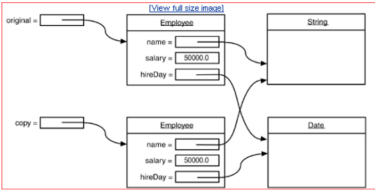
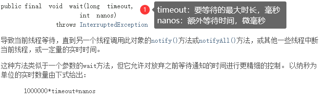

# 常用类

## Object类

大家都知道Object是所有类的父类，任何类都默认继承Object。 

理论上Object类是所有类的父类，即直接或间接的继承java.lang.Object类。 

由于所有的类都继承在Object类，因此省略了extends Object关键字。 

该类中主要有以下方法:

-  toString() 
- getClass() 
- equals() 
- clone() 
- finalize()
- 其中toString(),getClass(),equals是其中最重要的方法。

### clone() 方法

```java
protected native Object clone() throws CloneNotSupportedException;
```

clone顾名思义就是复制， 在Java语言中， clone方法被对象调用，所以会复制对象。所谓的复制对象， 首先要分配一个和源对象同样大小的空间，在这个空间中创建一个新的对象。那么在java语言中，有几种方式可以创建对象呢？ 

- 使用new操作符创建一个对象 
- 使用clone方法复制一个对象 

那么这两种方式有什么相同和不同呢？ 

new操作符的本意是分配内存。程序执行到new操作符时， 首先去看new操作符后面的类型，因为知道了类型，才能知道要分配多大的内存空间。分配完内存之后， 再调用构造函数，填充对象的各个域，这一步叫做对象的初始化，构造方法返回后，一个对象创建完毕，可以把他的引用（地址）发布到外部，在外部就可以使用这个引用操纵这个对象。而clone在第一步是和new相似的， 都是分配内存，调用clone方法时，分配的内存和源对象（即调用clone方法的对象） 相同，然后再使用原对象中对应的各个域，填充新对象的域， 填充完成之后，clone方法返回，一个新的相同的对象被创建，同样可以把这个新对象的引用发布到外部。

**clone与copy的区别**

假设现在有一个Employee对象

```java
Employee tobby =new Employee(“CMTobby”,5000) 
```

通常我们会有这样的赋值Employee cindyelf=tobby，这个时候只是简单了copy了一下reference， cindyelf和tobby都指向内存中同一个object，这样**cindyelf或者tobby**的一个操作都可能**影响到对方**。

打个比方，如果我们通过cindyelf.raiseSalary()方法改变了salary域的值，那么tobby通过getSalary()方法 得到的就是修改之后的salary域的值，显然这不是我们愿意看到的。

我们希望得到tobby的一个精确拷贝，同时两者互不影响，这时候， 我们就可以使用Clone来满足我们的需求。**Employee cindy=tobby.clone()**，这时会生成一个新的Employee对象，并且和tobby具有相同的属性值和方法。

**Shallow Clone与Deep Clone**

主要是JAVA里除了8种基本类型传参数是值传递，其他的类对象传参数都是引用，我们有时候不希望在 方法里将参数改变，这是就需要在类中复写clone方法（实现深复制）。 

Clone是如何完成的呢？Object在对某个对象实施Clone时对其是一无所知的，它仅仅是简单地执行域 对域的copy，这就是**Shallow Clone（浅克隆）**。这样，问题就来了咯。 以Employee为例，它里面有一个域hireDay不是基本数据类型的变量，而是一个reference变量，经过 Clone之后就会产生一个新的Date型的reference， 它和原始对象中对应的域指向同一个Date对象，这样克隆类就和原始类共享了一部分信息，而这样显然是不利的，过程下图所示：



这个时候我们就需要进行**deep Clone（深克隆）**了，对那些非基本类型的域进行特殊的处理，例如本例中的 hireDay。我们可以重新定义Clone方法，对hireDay做特殊处理，如下代码所示：

```java
class Employee implements Cloneable {
    public Object clone() throws CloneNotSupportedException {
        Employee cloned = (Employee) super.clone();
        cloned.hireDay = (Date) hireDay.clone()
        return cloned;
    }
}
```

**clone方法的保护机制**

Object做不到深拷贝，因为它不知道自定义的类里有哪些引用类型，在Object中Clone()是被声明为protected的，这样做是有一定的道理的。

以Employee类为例，通过声明 为protected，这样想要在其他任何地方调用这个类的clone方法，这个类就必须去重写clone方法。

而如果不重写就调用，则会编译失败。

```java
Class Person implements Cloneable{
}

Class Test{
    public void main(String [] args) throws ClontNotSupportedException{
        Person person =new Person();
        person.clone();          //编译错误（Object类型的clone方法不可见）
    }
}

Class Person implements Cloneable{
    @Override
    protected Object clone() throws CloneNotSupportedException {
        return super.clone();
    }
}

 Class Test{
     public void main(String [] args) throws ClontNotSupportedException{
         Person person =new Person();
         person.clone();          //编译通过
     }
}

```

**clone方法的使用**

什么时候使用shallow Clone，什么时候使用deep Clone，这个主要看具体对象的域是什么性质的，基本类型还是reference variable 

调用Clone()方法的对象所属的类(Class)必须implements Clonable接口，否则在调用Clone方法的时候会抛出CloneNotSupportedException

### toString()方法

```java
public String toString() {
	return getClass().getName() + "@" + Integer.toHexString(hashCode());
}
```

Object 类的 toString 方法返回一个字符串，该字符串由类名（对象是该类的一个实例）、at 标记符“@” 和此对象哈希码的无符号十六进制表示组成。 

该方法用得比较多，一般子类都有覆盖。

### getClass()方法

```java
public final native Class<?> getClass();
```

返回次Object的运行时类类型。 

不可重写，要调用的话，一般和getName()联合使用，如getClass().getName();

```java
public static void main(String[] args) {
    Object o = new Object();
    System.out.println(o.getClass());
    //class java.lang.Object
}
```

### finalize()方法

```java
protected void finalize() throws Throwable { }
```

该方法用于释放资源。因为无法确定该方法什么时候被调用，很少使用。 

Java允许在类中定义一个名为finalize()的方法。它的工作原理是：一旦垃圾回收器准备好释放对象占用的存储空间，将首先调用其finalize()方法。并且在下一次垃圾回收动作发生时，才会真正回收对象占用 的内存。 

关于垃圾回收，有三点需要记住： 

1. 对象可能不被垃圾回收。只要程序没有濒临存储空间用完的那一刻，对象占用的空间就总也得不到释放。 
2. 垃圾回收并不等于“析构”。 【科普：析构函数(destructor) 与构造函数相反，当对象结束其生命周期，如对象所在的函数已调用完毕时，系统自动执行析构函数。析构函数往往用来做“清理善后” 的工作（例如在建立对象时用new开辟 了一片内存空间，delete会自动调用析构函数后释放内存）。】 
3. 垃圾回收只与内存有关。使用垃圾回收的唯一原因是为了回收程序不再使用的内存。 

**finalize()的用途：** 

无论对象是如何创建的，垃圾回收器都会负责释放对象占据的所有内存。 

这就将对finalize()的需求限制到一种特殊情况，即通过某种创建对象方式以外的方式为对象分配了存储空间。不过这种情况一般发生在使用“本地方法”的情况下，本地方法是一种在Java中调用非Java代码的方式。

### equals()方法

```java
public boolean equals(Object obj) {
	return (this == obj);
}
```

Object中的equals方法是直接判断this和obj本身的值是否相等，即用来判断调用equals的对象和形参 obj所引用的对象是否是同一对象

所谓同一对象就是指内存中同一块存储单元，如果this和obj指向的hi同一块内存对象，则返回true,如果 this和obj指向的不是同一块内存，则返回false。

 **注意：**

即便是内容完全相等的两块不同的内存对象，也返回false。 如果是同一块内存，则object中的equals方法返回true,如果是不同的内存，则返回false 。

如果希望不同内存但相同内容的两个对象equals时返回true,则我们需要重写父类的equal方法 String类已经重写了object中的equals方法（这样就是比较内容是否相等了）

```java
//String类源码equals方法
public boolean equals(Object anObject) {
    if (this == anObject) {
        return true;
    }
    if (anObject instanceof String) {
        String anotherString = (String)anObject;
        int n = value.length;
        if (n == anotherString.value.length) {
            char v1[] = value;
            char v2[] = anotherString.value;
            int i = 0;
            while (n-- != 0) {
                if (v1[i] != v2[i])
                    return false;
                i++;
            }
            return true;
        }
    }
    return false;
}
```

### hashCode()方法

```java
public native int hashCode();
```

返回该对象的哈希码值。 该方法用于哈希查找，可以减少在查找中使用equals的次数，重写了equals方法一般都要重写 hashCode方法。这个方法在一些具有哈希功能的Collection中用到。

 一般必须满足**obj1.equals(obj2)==true**。可以推出**obj1.hash Code() == obj2.hashCode()**，但是**hashCode相等不一定就满足equals**。不过为了提高效率，应该尽量使上面两个条件接近等价。

### wait()方法

```java
public final void wait() throws InterruptedException {
	wait(0);
}

public final native void wait(long timeout) throws InterruptedException;

public final void wait(long timeout, int nanos) throws InterruptedException
{
    if (timeout < 0) {
    	throw new IllegalArgumentException("timeout value is negative");
    }
    if (nanos < 0 || nanos > 999999) {
    	throw new IllegalArgumentException("nanosecond timeout value out of range");
    }
    if (nanos > 0) {
    	timeout++;
    }
    wait(timeout);
}
```



wait方法就是使当前线程等待该对象的锁，当前线程必须是该对象的拥有者，也就是具有该对象的锁。 wait()方法一直等待，直到获得锁或者被中断。wait(long timeout)设定一个超时间隔

 如果在规定时间内没有获得锁就返回。 

调用该方法后当前线程进入睡眠状态，直到以下事件发生。 

1. 其他线程调用了该对象的notify方法。 
2. 其他线程调用了该对象的notifyAll方法。 
3. 其他线程调用了interrupt中断该线程。 
4. 时间间隔到了。 

此时该线程就可以被调度了，如果是被中断的话就抛出一个InterruptedException异常。

### notify()方法

```java
//该方法唤醒在该对象上等待的某个线程。
public final native void notify();
//该方法唤醒在该对象上等待的所有线程。
public final native void notifyAll();
```

## 包装类

### 介绍

虽然 Java 语言是典型的面向对象编程语言，但其中的八种基本数据类型并不支持面向对象编程，基本类 型的数据不具备“对象”的特性——不携带属性、没有方法可调用。 沿用它们只是为了迎合人类根深蒂固的习惯，并的确能简单、有效地进行常规数据处理。 

这种借助于非面向对象技术的做法有时也会带来不便，比如引用类型数据均继承了 Object 类的特性，要转换为 String 类型（经常有这种需要）时只要简单调用 Object 类中定义的toString()即可，而基本数据类型转换为 String 类型则要麻烦得多。为解决此类问题 ，Java为每种基本数据类型分别设计了对应的类，称之为**包装类**(Wrapper Classes)，也有教材称为**外覆类或数据类型类**。

| 基本数据类型 | 对应的包装类 |
| ------------ | ------------ |
| byte         | Byte         |
| short        | Short        |
| int          | Integer      |
| long         | Long         |
| char         | Character    |
| float        | Float        |
| double       | Double       |
| boolean      | Boolean      |

每个包装类的对象可以封装一个相应的基本类型的数据，并提供了其它一些有用的方法。包装类对象一 经创建，其内容（所封装的基本类型数据值）不可改变。 

基本类型和对应的包装类可以相互装换： 

- 由基本类型向对应的包装类转换称为装箱，例如把 int 包装成 Integer 类的对象； 

- 包装类向对应的基本类型转换称为拆箱，例如把 Integer 类的对象重新简化为 int。

### 应用

1. 实现 int 和 Integer 的相互转换

   ```java
   //可以通过 Integer 类的构造方法将 int 装箱，通过 Integer 类的 intValue 方法将 Integer 拆箱。
   public static void main(String[] args) {
       int m = 500;
       Integer obj = new Integer(m); // 手动装箱
       int n = obj.intValue(); // 手动拆箱
       System.out.println("n = " + n);
       Integer obj1 = new Integer(500);
       System.out.println("obj 等价于 obj1？" + obj.equals(obj1));
   }
   
   //结果
   n = 500
   obj 等价于 obj1？true
   ```

2. 将字符串转换为整数

   ```java
   //parseInt(String s, int radix);
   //s 为要转换的字符串，radix 为进制，可选，默认为十进制。
   
   public static void main(String[] args) {
       String[] str = {"123", "123abc", "abc123", "abcxyz"};
       for(String str1 : str){
           try{
               int m = Integer.parseInt(str1, 10);
               System.out.println(str1 + " 可以转换为整数 " + m);
           }catch(Exception e){
           	System.out.println(str1 + " 无法转换为整数");
           }
       }
   }
   
   //结果
   123 可以转换为整数 123
   123abc 无法转换为整数
   abc123 无法转换为整数
   abcxyz 无法转换为整数
   ```

3. 将整数转换为字符串

   ```java
   public static void main(String[] args) {
       int m = 500;
       String s = Integer.toString(m);
       String s2 = m+"";
       System.out.println("s = " + s);
   }
   ```

### 自动拆箱和装箱

上面的例子都需要手动实例化一个包装类，称为手动拆箱装箱。Java 1.5(5.0) 之前必须手动拆箱装箱。 

Java 1.5 之后可以自动拆箱装箱，也就是在进行基本数据类型和对应的包装类转换时，系统将自动进 行，这将大大方便程序员的代码书写。

```java
public static void main(String[] args) {
    int m = 500;
    Integer obj = m; // 自动装箱
    int n = obj; // 自动拆箱
    System.out.println("n = " + n);
    Integer obj1 = 500;
    System.out.println("obj 等价于 obj1？" + obj.equals(obj1));
}

//结果
n = 500
obj 等价于 obj1？true
```

自动装箱与拆箱的功能事实上是编译器来帮您的忙，编译器在编译时期依您所编写的语法，决定是否进行装箱或拆箱动作。例如：

```java
Integer i = 100;
//相当于编译器自动为您作以下的语法编译：
Integer i = new Integer(100);
```

所以自动装箱与拆箱的功能是所谓的“编译器蜜糖”(Compiler Sugar)，虽然使用这个功能很方便，但在程 序运行阶段您得了解Java的语义。例如下面的程序是可以通过编译的：

```java
Integer i = null;
int j = i;
```

这样的语法在编译时期是合法的，但是在运行时期会有错误，因为这种写法相当于：

```java
Integer i = null;
int j = i.intValue();
```

null表示i 没有参考至任何的对象实体，它可以合法地指定给对象参考名称。由于实际上i并没有参考至任何的对象，所以也就不可能操作intValue()方法，这样上面的写法在运行时会出现NullPointerException 错误。 

自动拆箱装箱是常用的一个功能，需要重点掌握。 

一般地，当需要使用数字的时候，我们通常使用内置数据类型，如：**byte、int、long、double** 等。然而，在实际开发过程中，我们经常会遇到需要使用对象，而不是内置数据类型的情形。为了解决这个问 题，Java 语言为每一个内置数据类型提供了对应的包装类。 所有的包装类（I**nteger、Long、Byte、Double、Float、Short**）都是**抽象类 Number 的子类**。

## Math类

```java
public static void main(String[] args) {
    /**
    *Math.sqrt()//计算平方根
    *Math.cbrt()//计算立方根
    *Math.pow(a, b)//计算a的b次方
    *Math.max( , );//计算最大值
    *Math.min( , );//计算最小值
    */
    System.out.println(Math.sqrt(16)); //4.0
    System.out.println(Math.cbrt(8)); //2.0
    System.out.println(Math.pow(3,2)); //9.0
    System.out.println(Math.max(2.3,4.5));//4.5
    System.out.println(Math.min(2.3,4.5));//2.3
    /**
    * abs求绝对值
    */
    System.out.println(Math.abs(-10.4)); //10.4
    System.out.println(Math.abs(10.1)); //10.1
    /**
    * ceil天花板的意思，就是返回大的值
    */
    System.out.println(Math.ceil(-10.1)); //-10.0
    System.out.println(Math.ceil(10.7)); //11.0
    System.out.println(Math.ceil(-0.7)); //-0.0
    System.out.println(Math.ceil(0.0)); //0.0
    System.out.println(Math.ceil(-0.0)); //-0.0
    System.out.println(Math.ceil(-1.7)); //-1.0
    /**
    * floor地板的意思，就是返回小的值
    */
    System.out.println(Math.floor(-10.1)); //-11.0
    System.out.println(Math.floor(10.7)); //10.0
    System.out.println(Math.floor(-0.7)); //-1.0
    System.out.println(Math.floor(0.0)); //0.0
    System.out.println(Math.floor(-0.0)); //-0.0
    /**
    * random 取得一个大于或者等于0.0 小于不等于1.0的随机数 [0,1)
    */
    System.out.println(Math.random()); //小于1大于0的double类型的数
    System.out.println(Math.random()+1);//大于1小于2的double类型的数
    /**
    * rint 四舍五入，返回double值
    * 注意.5的时候会取偶数 异常的尴尬=。=
    */
    System.out.println(Math.rint(10.1)); //10.0
    System.out.println(Math.rint(10.7)); //11.0
    System.out.println(Math.rint(11.5)); //12.0
    System.out.println(Math.rint(10.5)); //10.0
    System.out.println(Math.rint(10.51)); //11.0
    System.out.println(Math.rint(-10.5)); //-10.0
    System.out.println(Math.rint(-11.5)); //-12.0
    System.out.println(Math.rint(-10.51)); //-11.0
    System.out.println(Math.rint(-10.6)); //-11.0
    System.out.println(Math.rint(-10.2)); //-10.0
    /**
    * round 四舍五入，float时返回int值，double时返回long值
    */
    System.out.println(Math.round(10.1)); //10
    System.out.println(Math.round(10.7)); //11
    System.out.println(Math.round(10.5)); //11
    System.out.println(Math.round(10.51)); //11
    System.out.println(Math.round(-10.5)); //-10
    System.out.println(Math.round(-10.51)); //-11
    System.out.println(Math.round(-10.6)); //-11
    System.out.println(Math.round(-10.2)); //-10
}
```

## Random类

### java.lang.Math.Random

调用这个Math.Random()函数能够返回带正号的double值，该值大于等于0.0且小于1.0，即取值范围是 [0.0,1.0)的左闭右开区间，返回值是一个伪随机选择的数，在该范围内（近似）均匀分布。例子如下：

```java
public static void main(String[] args) {
    // 结果是个double类型的值，区间为[0.0,1.0）
    System.out.println("Math.random()=" + Math.random());
    int num = (int) (Math.random() * 3);
    // 注意不要写成(int)Math.random()*3，这个结果为0或1，因为先执行了强制转换
    System.out.println("num=" + num);
}

//结果
//Math.random()=0.44938147153848396
//num=1
```

### java.util.Random

下面是Random()的两种构造方法：

Random()：创建一个新的随机数生成器。 

Random(long seed)：使用单个 long 种子创建一个新的随机数生成器。 你在创建一个Random对象的时候可以给定任意一个合法的种子数，种子数只是随机算法的起源数字， 和生成的随机数的区间没有任何关系。

```java
//在没带参数构造函数生成的Random对象的种子缺省是当前系统时间的毫秒数。
//rand.nextInt(100)中的100是随机数的上限,产生的随机数为0-100的整数,不包括100。
public static void main(String[] args) {
    Random rand =new Random();
    int i=rand.nextInt(100);
    System.out.println(i);
}
//结果,多次结果不同
//73

对于种子相同的Random对象，生成的随机数序列是一样的。
public static void main(String[] args) {
    Random ran1 = new Random(25);
    System.out.println("使用种子为25的Random对象生成[0,100)内随机整数序列: ");
    for (int i = 0; i < 10; i++) {
        System.out.print(ran1.nextInt(100) + " ");
    }
    System.out.println();
}
//结果
//使用种子为25的Random对象生成[0,100)内随机整数序列: 
//81 28 47 38 97 98 95 37 96 54 
```

#### 方法摘要

1.  protected int next(int bits)：生成下一个伪随机数。 
2. boolean nextBoolean()：返回下一个伪随机数，它是取自此随机数生成器序列的均匀分布的 boolean值。 
3. void nextBytes(byte[] bytes)：生成随机字节并将其置于用户提供的 byte 数组中。 
4. double nextDouble()：返回下一个伪随机数，它是取自此随机数生成器序列的、在0.0和1.0之间 均匀分布的 double值。 
5.  float nextFloat()：返回下一个伪随机数，它是取自此随机数生成器序列的、在0.0和1.0之间均匀分 布float值。 
6. double nextGaussian()：返回下一个伪随机数，它是取自此随机数生成器序列的、呈高斯（“正态”）分布的double值，其平均值是0.0标准差是1.0。 
7. int nextInt()：返回下一个伪随机数，它是此随机数生成器的序列中均匀分布的 int 值。 
8. int nextInt(int n)：返回一个伪随机数，它是取自此随机数生成器序列的、在（包括和指定值（不 包括）之间均匀分布的int值。 
9. long nextLong()：返回下一个伪随机数，它是取自此随机数生成器序列的均匀分布的 long 值。 
10. void setSeed(long seed)：使用单个 long 种子设置此随机数生成器的种子。

**示例：**

1. 生成[0,1.0)区间的小数：double d1 = r.nextDouble(); 
2. 生成[0,5.0)区间的小数：double d2 = r.nextDouble() * 5; 
3. 生成[1,2.5)区间的小数：double d3 = r.nextDouble() * 1.5 + 1; 
4. 生成[0,10)区间的整数：int n2 = r.nextInt(10);

## 日期时间类

### Date类

java.util 包提供了 Date 类来封装当前的日期和时间。 

Date 类提供两个构造函数来实例化 Date 对象。 

第一个构造函数使用当前日期和时间来初始化对象。

第二个构造函数接收一个参数，该参数是从1970年1月1日起的毫秒数。

```java
Date()
Date(long millisec)
```

**方法**

| 序 号 | 方法和描述                                                   |
| ----- | ------------------------------------------------------------ |
| 1     | **boolean after(Date date)** 若当调用此方法的Date对象在指定日期之后返回true,否则返回 false。 |
| 2     | **boolean before(Date date)** 若当调用此方法的Date对象在指定日期之前返回true,否则返 回false。 |
| 3     | **Object clone( )** 返回此对象的副本。                       |
| 4     | **int compareTo(Date date)** 比较当调用此方法的Date对象和指定日期。两者相等时候返回 0。调用对象在指定日期之前则返回负数。调用对象在指定日期之后则返回正数。 |
| 5     | **int compareTo(Object obj)** 若obj是Date类型则操作等同于compareTo(Date) 。否则它抛 出ClassCastException。 |
| 6     | **boolean equals(Object date)** 当调用此方法的Date对象和指定日期相等时候返回true,否则返回false。 |
| 7     | **long getTime( )** 返回自 1970 年 1 月 1 日 00:00:00 GMT 以来此 Date 对象表示的毫秒数。 |
| 8     | **int hashCode( )** 返回此对象的哈希码值。                   |
| 9     | **void setTime(long time)** 用自1970年1月1日00:00:00 GMT以后time毫秒数设置时间和日 期。 |
| 10    | **String toString( )** 把此 Date 对象转换为以下形式的 String： dow mon dd hh:mm:ss zzz yyyy 其中： dow 是一周中的某一天 (Sun, Mon, Tue, Wed, Thu, Fri, Sat)。 |

```java
public static void main(String args[]) {
    // 初始化 Date 对象
    Date date = new Date();
    
    // 使用 toString() 函数显示日期时间
    System.out.println(date.toString());
    //Sat Apr 27 15:09:43 CST 2019
    
    //getTime
    long time = date.getTime();
	long time2 = date.getTime();
	System.out.println(time==time2);  //true
	
	boolean before = new Date(97, 01, 05).before(new Date(99, 11, 16));
	System.out.println(before);  //true
}
```

### SimpleDateFormat

SimpleDateFormat 是一个以语言环境敏感的方式来格式化和分析日期的类。SimpleDateFormat 允许你选择任何用户自定义日期时间格式来运行。例如：

```java
public static void main(String args[]) {
    Date dNow = new Date( );
    SimpleDateFormat ft = new SimpleDateFormat ("yyyy-MM-dd hh:mm:ss");
    System.out.println("当前时间为: " + ft.format(dNow));
}
```

其中 yyyy 是完整的公元年，MM 是月份，dd 是日期，HH:mm:ss 是时、分、秒。 

**注意**:有的格式大写，有的格式小写，例如 MM 是月份，mm 是分；HH 是 24 小时制，而 hh 是 12 小时 制。

### Calendar类

我们现在已经能够格式化并创建一个日期对象了，但是我们如何才能设置和获取日期数据的特定部分呢，比如说小时，日，或者分钟? 我们又如何在日期的这些部分加上或者减去值呢? 答案是使用Calendar 类。

Date中有很多方法都已经废弃了！ Calendar类的功能要比Date类强大很多，而且在实现方式上也比Date类要复杂一些。 

Calendar类是一个抽象类，在实际使用时实现特定的子类的对象，创建对象的过程对程序员来说是透明 的，只需要使用getInstance方法创建即可。

```java
public static void main(String args[]) {
    Calendar c = Calendar.getInstance();//默认是当前日期
    System.out.println(c);
}
//输出
java.util.GregorianCalendar[time=1656066899066,areFieldsSet=true,areAllFieldsSet=true,lenient=true,zone=sun.util.calendar.ZoneInfo[id="Asia/Shanghai",offset=28800000,dstSavings=0,useDaylight=false,transitions=19,lastRule=null],firstDayOfWeek=1,minimalDaysInFirstWeek=1,ERA=1,YEAR=2022,MONTH=5,WEEK_OF_YEAR=26,WEEK_OF_MONTH=4,DAY_OF_MONTH=24,DAY_OF_YEAR=175,DAY_OF_WEEK=6,DAY_OF_WEEK_IN_MONTH=4,AM_PM=1,HOUR=6,HOUR_OF_DAY=18,MINUTE=34,SECOND=59,MILLISECOND=66,ZONE_OFFSET=28800000,DST_OFFSET=0]
```

**字段**

```java
// 获得年份
int year = c1.get(Calendar.YEAR);
// 获得月份
int month = c1.get(Calendar.MONTH) + 1;
// 获得日期
int date = c1.get(Calendar.DATE);
// 获得小时
int hour = c1.get(Calendar.HOUR_OF_DAY);
// 获得分钟
int minute = c1.get(Calendar.MINUTE);
// 获得秒
int second = c1.get(Calendar.SECOND);
// 获得星期几（注意（这个与Date类是不同的）：1代表星期日、2代表星期1、3代表星期二，以此类
推）
int day = c1.get(Calendar.DAY_OF_WEEK);
```

**方法**

- Calendar.set(),设置年月日等
- Calendar.get(),获取年月日等
- Calendar.add(),日期加n天或减n天

**注意：Calender的月份是从0开始的，但日期和年份是从1开始的**

```java
public static void main(String[] args) {
    Calendar c1 = Calendar.getInstance();
    c1.set(2017, 1, 1);
    System.out.println(c1.get(Calendar.YEAR)
                       +"-"+c1.get(Calendar.MONTH)
                       +"-"+c1.get(Calendar.DATE));
    c1.set(2017, 1, 0);
    System.out.println(c1.get(Calendar.YEAR)
                       +"-"+c1.get(Calendar.MONTH)
                       +"-"+c1.get(Calendar.DATE));
}
//输出
2017-1-1
2017-0-31

public static void main(String[] args) {
    Calendar c1 = Calendar.getInstance();
    c1.set(2017, 2, 1);
    System.out.println(c1.get(Calendar.YEAR)
                       +"-"+c1.get(Calendar.MONTH)
                       +"-"+c1.get(Calendar.DATE));
    c1.set(2017, 2, 0);
    System.out.println(c1.get(Calendar.YEAR)
                       +"-"+c1.get(Calendar.MONTH)
                       +"-"+c1.get(Calendar.DATE));
}
//输出
2017-2-1
2017-1-28    
```

## String类
